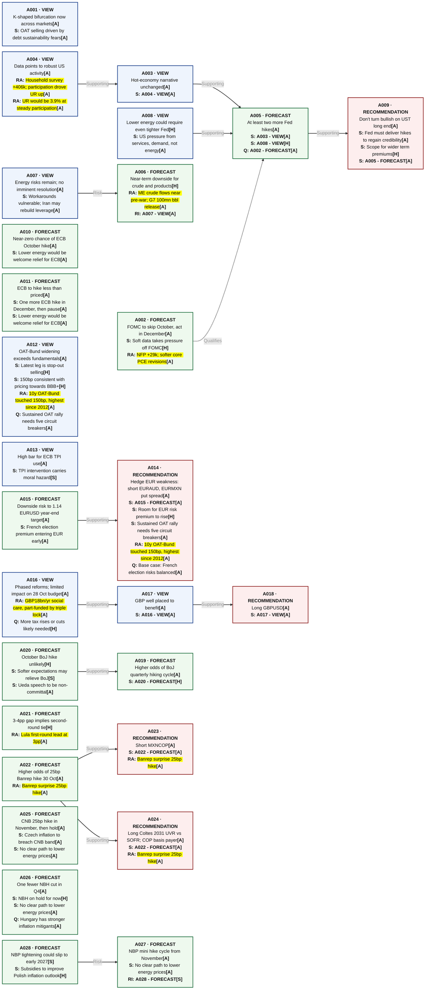

```mermaid
%%{init: {"flowchart": {"htmlLabels": true, "nodeSpacing": 20, "rankSpacing": 60}, "themeCSS": ".arg{width:330px;text-align:left;color:#111111} .core,.c{display:flex;justify-content:space-between;align-items:flex-end;gap:8px;margin-top:4px;padding:3px 6px;color:#111111} .core{border:2px solid} .c{border:1.5px solid;border-radius:10px} .rec{background:#f8c9c9;border-color:#8b1a1a} .val{background:#e3d4f5;border-color:#5b2c8f} .fc{background:#c9ecc9;border-color:#1a6b3a} .view{background:#c9dcf8;border-color:#1a3f8b} .dp{background:#d4d4d4;border-color:#5f5f5f} .obs{background:#e6e6e6;border-color:#888888} mark{background:#e6e6e6;color:#111111;padding:0 2px} .edgeLabel,.edgeLabel *{color:#9a9a9a !important;fill:#9a9a9a !important}"}}%%
flowchart LR
    A001["<div class='arg'><b>A001 · VIEW</b><div class='core view'><span>K-shaped bifurcation now across markets</span><b>[A]</b></div><div class='c view'><span><b>S:</b> OAT selling driven by debt sustainability fears</span><b>[A]</b></div></div>"]
    A002["<div class='arg'><b>A002 · FORECAST</b><div class='core fc'><span>FOMC to skip October, act in December</span><b>[A]</b></div><div class='c view'><span><b>S:</b> Soft data takes pressure off FOMC</span><b>[H]</b></div><div class='c dp'><span><b>RA:</b> <mark>NFP +29k; softer core PCE revisions</mark></span><b>[A]</b></div></div>"]
    A003["<div class='arg'><b>A003 · VIEW</b><div class='core view'><span>Hot-economy narrative unchanged</span><b>[A]</b></div><div class='c view'><span><b>S:</b> <b>A004 - VIEW</b></span><b>[A]</b></div></div>"]
    A004["<div class='arg'><b>A004 · VIEW</b><div class='core view'><span>Data points to robust US activity</span><b>[A]</b></div><div class='c dp'><span><b>RA:</b> <mark>Household survey +406k; participation drove UR up</mark></span><b>[A]</b></div><div class='c dp'><span><b>RA:</b> <mark>UR would be 3.9% at steady participation</mark></span><b>[A]</b></div></div>"]
    A005["<div class='arg'><b>A005 · FORECAST</b><div class='core fc'><span>At least two more Fed hikes</span><b>[A]</b></div><div class='c view'><span><b>S:</b> <b>A003 - VIEW</b></span><b>[A]</b></div><div class='c view'><span><b>S:</b> <b>A008 - VIEW</b></span><b>[H]</b></div><div class='c fc'><span><b>Q:</b> <b>A002 - FORECAST</b></span><b>[A]</b></div></div>"]
    A006["<div class='arg'><b>A006 · FORECAST</b><div class='core fc'><span>Near-term downside for crude and products</span><b>[H]</b></div><div class='c dp'><span><b>RA:</b> <mark>ME crude flows near pre-war; G7 100mn bbl release</mark></span><b>[A]</b></div><div class='c view'><span><b>RI:</b> <b>A007 - VIEW</b></span><b>[A]</b></div></div>"]
    A007["<div class='arg'><b>A007 · VIEW</b><div class='core view'><span>Energy risks remain; no imminent resolution</span><b>[A]</b></div><div class='c view'><span><b>S:</b> Workarounds vulnerable; Iran may rebuild leverage</span><b>[A]</b></div></div>"]
    A008["<div class='arg'><b>A008 · VIEW</b><div class='core view'><span>Lower energy could require even tighter Fed</span><b>[H]</b></div><div class='c view'><span><b>S:</b> US pressure from services, demand, not energy</span><b>[A]</b></div></div>"]
    A009["<div class='arg'><b>A009 · RECOMMENDATION</b><div class='core rec'><span>Don't turn bullish on UST long end</span><b>[A]</b></div><div class='c view'><span><b>S:</b> Fed must deliver hikes to regain credibility</span><b>[A]</b></div><div class='c fc'><span><b>S:</b> Scope for wider term premiums</span><b>[H]</b></div><div class='c fc'><span><b>S:</b> <b>A005 - FORECAST</b></span><b>[A]</b></div></div>"]
    A010["<div class='arg'><b>A010 · FORECAST</b><div class='core fc'><span>Near-zero chance of ECB October hike</span><b>[A]</b></div><div class='c view'><span><b>S:</b> Lower energy would be welcome relief for ECB</span><b>[A]</b></div></div>"]
    A011["<div class='arg'><b>A011 · FORECAST</b><div class='core fc'><span>ECB to hike less than priced</span><b>[A]</b></div><div class='c fc'><span><b>S:</b> One more ECB hike in December, then pause</span><b>[A]</b></div><div class='c view'><span><b>S:</b> Lower energy would be welcome relief for ECB</span><b>[A]</b></div></div>"]
    A012["<div class='arg'><b>A012 · VIEW</b><div class='core view'><span>OAT-Bund widening exceeds fundamentals</span><b>[A]</b></div><div class='c view'><span><b>S:</b> Latest leg is stop-out selling</span><b>[H]</b></div><div class='c val'><span><b>S:</b> 150bp consistent with pricing towards BBB+</span><b>[H]</b></div><div class='c dp'><span><b>RA:</b> <mark>10y OAT-Bund touched 150bp, highest since 2012</mark></span><b>[A]</b></div><div class='c view'><span><b>Q:</b> Sustained OAT rally needs five circuit breakers</span><b>[A]</b></div></div>"]
    A013["<div class='arg'><b>A013 · VIEW</b><div class='core view'><span>High bar for ECB TPI use</span><b>[A]</b></div><div class='c view'><span><b>S:</b> TPI intervention carries moral hazard</span><b>[S]</b></div></div>"]
    A014["<div class='arg'><b>A014 · RECOMMENDATION</b><div class='core rec'><span>Hedge EUR weakness: short EURAUD, EURMXN put spread</span><b>[A]</b></div><div class='c fc'><span><b>S:</b> <b>A015 - FORECAST</b></span><b>[A]</b></div><div class='c view'><span><b>S:</b> Room for EUR risk premium to rise</span><b>[H]</b></div><div class='c view'><span><b>S:</b> Sustained OAT rally needs five circuit breakers</span><b>[A]</b></div><div class='c dp'><span><b>RA:</b> <mark>10y OAT-Bund touched 150bp, highest since 2012</mark></span><b>[A]</b></div><div class='c view'><span><b>Q:</b> Base case: French election risks balanced</span><b>[A]</b></div></div>"]
    A015["<div class='arg'><b>A015 · FORECAST</b><div class='core fc'><span>Downside risk to 1.14 EURUSD year-end target</span><b>[A]</b></div><div class='c view'><span><b>S:</b> French election premium entering EUR early</span><b>[A]</b></div></div>"]
    A016["<div class='arg'><b>A016 · VIEW</b><div class='core view'><span>Phased reforms; limited impact on 28 Oct budget</span><b>[A]</b></div><div class='c dp'><span><b>RA:</b> <mark>GBP18bn/yr social care, part-funded by triple lock</mark></span><b>[A]</b></div><div class='c fc'><span><b>Q:</b> More tax rises or cuts likely needed</span><b>[H]</b></div></div>"]
    A017["<div class='arg'><b>A017 · VIEW</b><div class='core view'><span>GBP well placed to benefit</span><b>[A]</b></div><div class='c view'><span><b>S:</b> <b>A016 - VIEW</b></span><b>[A]</b></div></div>"]
    A018["<div class='arg'><b>A018 · RECOMMENDATION</b><div class='core rec'><span>Long GBPUSD</span><b>[A]</b></div><div class='c view'><span><b>S:</b> <b>A017 - VIEW</b></span><b>[A]</b></div></div>"]
    A019["<div class='arg'><b>A019 · FORECAST</b><div class='core fc'><span>Higher odds of BoJ quarterly hiking cycle</span><b>[A]</b></div><div class='c fc'><span><b>S:</b> <b>A020 - FORECAST</b></span><b>[H]</b></div></div>"]
    A020["<div class='arg'><b>A020 · FORECAST</b><div class='core fc'><span>October BoJ hike unlikely</span><b>[H]</b></div><div class='c view'><span><b>S:</b> Softer expectations may relieve BoJ</span><b>[S]</b></div><div class='c fc'><span><b>S:</b> Ueda speech to be non-committal</span><b>[A]</b></div></div>"]
    A021["<div class='arg'><b>A021 · FORECAST</b><div class='core fc'><span>3-4pp gap implies second-round tie</span><b>[H]</b></div><div class='c dp'><span><b>RA:</b> <mark>Lula first-round lead at 3pp</mark></span><b>[A]</b></div></div>"]
    A022["<div class='arg'><b>A022 · FORECAST</b><div class='core fc'><span>Higher odds of 25bp Banrep hike 30 Oct</span><b>[A]</b></div><div class='c dp'><span><b>RA:</b> <mark>Banrep surprise 25bp hike</mark></span><b>[A]</b></div></div>"]
    A023["<div class='arg'><b>A023 · RECOMMENDATION</b><div class='core rec'><span>Short MXNCOP</span><b>[A]</b></div><div class='c fc'><span><b>S:</b> <b>A022 - FORECAST</b></span><b>[A]</b></div><div class='c dp'><span><b>RA:</b> <mark>Banrep surprise 25bp hike</mark></span><b>[A]</b></div></div>"]
    A024["<div class='arg'><b>A024 · RECOMMENDATION</b><div class='core rec'><span>Long Coltes 2031 UVR vs SOFR; COP basis payer</span><b>[A]</b></div><div class='c fc'><span><b>S:</b> <b>A022 - FORECAST</b></span><b>[A]</b></div><div class='c dp'><span><b>RA:</b> <mark>Banrep surprise 25bp hike</mark></span><b>[A]</b></div></div>"]
    A025["<div class='arg'><b>A025 · FORECAST</b><div class='core fc'><span>CNB 25bp hike in November, then hold</span><b>[A]</b></div><div class='c fc'><span><b>S:</b> Czech inflation to breach CNB band</span><b>[A]</b></div><div class='c view'><span><b>S:</b> No clear path to lower energy prices</span><b>[A]</b></div></div>"]
    A026["<div class='arg'><b>A026 · FORECAST</b><div class='core fc'><span>One fewer NBH cut in Q4</span><b>[A]</b></div><div class='c fc'><span><b>S:</b> NBH on hold for now</span><b>[H]</b></div><div class='c view'><span><b>S:</b> No clear path to lower energy prices</span><b>[A]</b></div><div class='c view'><span><b>Q:</b> Hungary has stronger inflation mitigants</span><b>[A]</b></div></div>"]
    A027["<div class='arg'><b>A027 · FORECAST</b><div class='core fc'><span>NBP mini hike cycle from November</span><b>[A]</b></div><div class='c view'><span><b>S:</b> No clear path to lower energy prices</span><b>[A]</b></div><div class='c fc'><span><b>RI:</b> <b>A028 - FORECAST</b></span><b>[S]</b></div></div>"]
    A028["<div class='arg'><b>A028 · FORECAST</b><div class='core fc'><span>NBP tightening could slip to early 2027</span><b>[S]</b></div><div class='c fc'><span><b>S:</b> Subsidies to improve Polish inflation outlook</span><b>[H]</b></div></div>"]

    A004 -- Supporting --> A003
    A003 -- Supporting --> A005
    A008 -- Supporting --> A005
    A002 -. Qualifies .-> A005
    A007 -- Risk --> A006
    A005 -- Supporting --> A009
    A015 -- Supporting --> A014
    A016 -- Supporting --> A017
    A017 -- Supporting --> A018
    A020 -- Supporting --> A019
    A022 -- Supporting --> A023
    A022 -- Supporting --> A024
    A028 -- Risk --> A027

    classDef fc fill:#eef9ee,stroke:#1a6b3a,stroke-width:2px,color:#111111
    classDef rec fill:#fdeeee,stroke:#8b1a1a,stroke-width:2px,color:#111111
    classDef view fill:#eef4fd,stroke:#1a3f8b,stroke-width:2px,color:#111111
    class A002,A005,A006,A010,A011,A015,A019,A020,A021,A022,A025,A026,A027,A028 fc
    class A009,A014,A018,A023,A024 rec
    class A001,A003,A004,A007,A008,A012,A013,A016,A017 view
    linkStyle default stroke:#333333,stroke-width:2px,color:#9a9a9a
```
