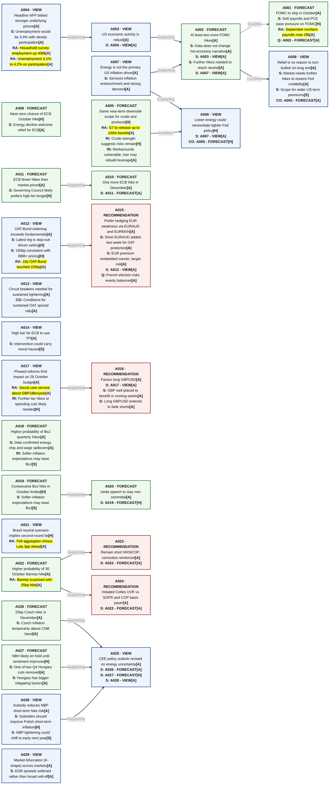

```mermaid
%%{init: {"flowchart": {"htmlLabels": true, "nodeSpacing": 20, "rankSpacing": 60}, "themeCSS": ".arg{width:330px;text-align:left;color:#111111} .core,.c{display:flex;justify-content:space-between;align-items:flex-end;gap:8px;margin-top:4px;padding:3px 6px;color:#111111} .core{border:2px solid} .c{border:1.5px solid;border-radius:10px} .rec{background:#f8c9c9;border-color:#8b1a1a} .val{background:#e3d4f5;border-color:#5b2c8f} .fc{background:#c9ecc9;border-color:#1a6b3a} .view{background:#c9dcf8;border-color:#1a3f8b} .dp{background:#d4d4d4;border-color:#5f5f5f} .obs{background:#e6e6e6;border-color:#888888} mark{background:#e6e6e6;color:#111111;padding:0 2px} .edgeLabel,.edgeLabel *{color:#9a9a9a !important;fill:#9a9a9a !important}"}}%%
flowchart LR
    A001["<div class='arg'><b>A001 · FORECAST</b><div class='core fc'><span>FOMC to skip in October</span><b>[A]</b></div><div class='c view'><span><b>S:</b> Soft payrolls and PCE ease pressure on FOMC</span><b>[H]</b></div><div class='c dp'><span><b>RA:</b> <mark>September nonfarm payrolls rose 29k</mark></span><b>[A]</b></div><div class='c fc'><span><b>Q:</b> <b>A002 - FORECAST</b></span><b>[A]</b></div></div>"]
    A002["<div class='arg'><b>A002 · FORECAST</b><div class='core fc'><span>At least two more FOMC hikes</span><b>[A]</b></div><div class='c view'><span><b>S:</b> Data does not change hot-economy narrative</span><b>[A]</b></div><div class='c view'><span><b>S:</b> <b>A003 - VIEW</b></span><b>[A]</b></div><div class='c view'><span><b>S:</b> Further hikes needed to reach neutral</span><b>[A]</b></div><div class='c view'><span><b>S:</b> <b>A007 - VIEW</b></span><b>[A]</b></div></div>"]
    A003["<div class='arg'><b>A003 · VIEW</b><div class='core view'><span>US economic activity is robust</span><b>[A]</b></div><div class='c view'><span><b>S:</b> <b>A004 - VIEW</b></span><b>[A]</b></div></div>"]
    A004["<div class='arg'><b>A004 · VIEW</b><div class='core view'><span>Headline NFP belied stronger underlying picture</span><b>[A]</b></div><div class='c fc'><span><b>S:</b> Unemployment would be 3.9% with steady participation</span><b>[A]</b></div><div class='c dp'><span><b>RA:</b> <mark>Household survey employment up 406k</mark></span><b>[A]</b></div><div class='c dp'><span><b>RA:</b> <mark>Unemployment 4.1% to 4.2% on participation</mark></span><b>[A]</b></div></div>"]
    A005["<div class='arg'><b>A005 · FORECAST</b><div class='core fc'><span>Some near-term downside scope for crude and products</span><b>[H]</b></div><div class='c dp'><span><b>RA:</b> <mark>G7 to release up to 100m barrels</mark></span><b>[A]</b></div><div class='c view'><span><b>RI:</b> Crude strength suggests risks remain</span><b>[H]</b></div><div class='c view'><span><b>RI:</b> Workarounds vulnerable; Iran may rebuild leverage</span><b>[A]</b></div></div>"]
    A006["<div class='arg'><b>A006 · VIEW</b><div class='core view'><span>Lower energy could necessitate tighter Fed policy</span><b>[H]</b></div><div class='c view'><span><b>S:</b> <b>A007 - VIEW</b></span><b>[A]</b></div><div class='c fc'><span><b>CO:</b> <b>A005 - FORECAST</b></span><b>[H]</b></div></div>"]
    A007["<div class='arg'><b>A007 · VIEW</b><div class='core view'><span>Energy is not the primary US inflation driver</span><b>[A]</b></div><div class='c view'><span><b>S:</b> Services inflation entrenchment and strong demand</span><b>[A]</b></div></div>"]
    A008["<div class='arg'><b>A008 · VIEW</b><div class='core view'><span>Relief is no reason to turn bullish on long end</span><b>[A]</b></div><div class='c view'><span><b>S:</b> Market needs further hikes to restore Fed credibility</span><b>[A]</b></div><div class='c fc'><span><b>S:</b> Scope for wider US term premiums</span><b>[S]</b></div><div class='c fc'><span><b>CO:</b> <b>A002 - FORECAST</b></span><b>[A]</b></div></div>"]
    A009["<div class='arg'><b>A009 · FORECAST</b><div class='core fc'><span>Near-zero chance of ECB October hike</span><b>[H]</b></div><div class='c view'><span><b>S:</b> Energy decline welcome relief for ECB</span><b>[A]</b></div></div>"]
    A010["<div class='arg'><b>A010 · FORECAST</b><div class='core fc'><span>One more ECB hike in December</span><b>[A]</b></div><div class='c fc'><span><b>S:</b> <b>A011 - FORECAST</b></span><b>[A]</b></div></div>"]
    A011["<div class='arg'><b>A011 · FORECAST</b><div class='core fc'><span>ECB fewer hikes than market priced</span><b>[A]</b></div><div class='c view'><span><b>S:</b> Governing Council likely prefers high-for-longer</span><b>[H]</b></div></div>"]
    A012["<div class='arg'><b>A012 · VIEW</b><div class='core view'><span>OAT-Bund widening exceeds fundamentals</span><b>[A]</b></div><div class='c view'><span><b>S:</b> Latest leg is stop-out-driven selling</span><b>[H]</b></div><div class='c val'><span><b>S:</b> 150bp consistent with BBB+ pricing</span><b>[H]</b></div><div class='c dp'><span><b>RA:</b> <mark>10y OAT-Bund touched 150bp</mark></span><b>[A]</b></div></div>"]
    A013["<div class='arg'><b>A013 · VIEW</b><div class='core view'><span>Circuit breakers needed for sustained tightening</span><b>[A]</b></div><div class='c view'><span><b>CO:</b> Conditions for sustained OAT spread rally</span><b>[A]</b></div></div>"]
    A014["<div class='arg'><b>A014 · VIEW</b><div class='core view'><span>High bar for ECB to use TPI</span><b>[A]</b></div><div class='c view'><span><b>S:</b> Intervention could carry moral hazard</span><b>[S]</b></div></div>"]
    A015["<div class='arg'><b>A015 · RECOMMENDATION</b><div class='core rec'><span>Prefer hedging EUR weakness via EURAUD and EURMXN</span><b>[A]</b></div><div class='c rec'><span><b>S:</b> Short EURAUD added last week for OAT protection</span><b>[A]</b></div><div class='c view'><span><b>S:</b> EUR premium embedded sooner; target risk</span><b>[A]</b></div><div class='c view'><span><b>S:</b> <b>A012 - VIEW</b></span><b>[A]</b></div><div class='c view'><span><b>Q:</b> French election risks evenly balanced</span><b>[A]</b></div></div>"]
    A016["<div class='arg'><b>A016 · RECOMMENDATION</b><div class='core rec'><span>Favour long GBPUSD</span><b>[A]</b></div><div class='c view'><span><b>S:</b> <b>A017 - VIEW</b></span><b>[A]</b></div><div class='c view'><span><b>S:</b> GBP well placed to benefit in coming weeks</span><b>[A]</b></div><div class='c rec'><span><b>S:</b> Long GBPUSD entered to fade shorts</span><b>[A]</b></div></div>"]
    A017["<div class='arg'><b>A017 · VIEW</b><div class='core view'><span>Phased reforms limit impact on 28 October budget</span><b>[A]</b></div><div class='c dp'><span><b>RA:</b> <mark>Social care service about GBP18bn/year</mark></span><b>[A]</b></div><div class='c view'><span><b>RI:</b> Further tax hikes or spending cuts likely needed</span><b>[H]</b></div></div>"]
    A018["<div class='arg'><b>A018 · FORECAST</b><div class='core fc'><span>Higher probability of BoJ quarterly hikes</span><b>[A]</b></div><div class='c view'><span><b>S:</b> Data confirmed energy, chip and wage spillovers</span><b>[A]</b></div><div class='c view'><span><b>RI:</b> Softer inflation expectations may ease BoJ</span><b>[S]</b></div></div>"]
    A019["<div class='arg'><b>A019 · FORECAST</b><div class='core fc'><span>Consecutive BoJ hike in October limited</span><b>[H]</b></div><div class='c view'><span><b>S:</b> Softer inflation expectations may ease BoJ</span><b>[S]</b></div></div>"]
    A020["<div class='arg'><b>A020 · FORECAST</b><div class='core fc'><span>Ueda speech to stay non-committal</span><b>[A]</b></div><div class='c fc'><span><b>S:</b> <b>A019 - FORECAST</b></span><b>[H]</b></div></div>"]
    A021["<div class='arg'><b>A021 · VIEW</b><div class='core view'><span>Brazil neutral scenario implies second-round tie</span><b>[H]</b></div><div class='c dp'><span><b>RA:</b> <mark>Poll aggregator shows Lula 3pp ahead</mark></span><b>[A]</b></div></div>"]
    A022["<div class='arg'><b>A022 · FORECAST</b><div class='core fc'><span>Higher probability of 30 October Banrep hike</span><b>[A]</b></div><div class='c dp'><span><b>RA:</b> <mark>Banrep surprised with 25bp hike</mark></span><b>[A]</b></div></div>"]
    A023["<div class='arg'><b>A023 · RECOMMENDATION</b><div class='core rec'><span>Remain short MXNCOP; conviction reinforced</span><b>[A]</b></div><div class='c fc'><span><b>S:</b> <b>A022 - FORECAST</b></span><b>[A]</b></div></div>"]
    A024["<div class='arg'><b>A024 · RECOMMENDATION</b><div class='core rec'><span>Initiated Coltes UVR vs SOFR and COP basis payer</span><b>[A]</b></div><div class='c fc'><span><b>S:</b> <b>A022 - FORECAST</b></span><b>[A]</b></div></div>"]
    A025["<div class='arg'><b>A025 · VIEW</b><div class='core view'><span>CEE policy outlook revised on energy uncertainty</span><b>[A]</b></div><div class='c fc'><span><b>S:</b> <b>A026 - FORECAST</b></span><b>[A]</b></div><div class='c fc'><span><b>S:</b> <b>A027 - FORECAST</b></span><b>[H]</b></div><div class='c view'><span><b>S:</b> <b>A028 - VIEW</b></span><b>[A]</b></div></div>"]
    A026["<div class='arg'><b>A026 · FORECAST</b><div class='core fc'><span>25bp Czech hike in November</span><b>[A]</b></div><div class='c fc'><span><b>S:</b> Czech inflation temporarily above CNB band</span><b>[A]</b></div></div>"]
    A027["<div class='arg'><b>A027 · FORECAST</b><div class='core fc'><span>NBH likely on hold until sentiment improves</span><b>[H]</b></div><div class='c fc'><span><b>S:</b> One of two Q4 Hungary cuts removed</span><b>[A]</b></div><div class='c view'><span><b>S:</b> Hungary has bigger mitigating factors</span><b>[A]</b></div></div>"]
    A028["<div class='arg'><b>A028 · VIEW</b><div class='core view'><span>Subsidy reduces NBP short-term hike risk</span><b>[A]</b></div><div class='c view'><span><b>S:</b> Subsidies should improve Polish short-term inflation</span><b>[H]</b></div><div class='c fc'><span><b>S:</b> NBP tightening could shift to early next year</span><b>[S]</b></div></div>"]
    A029["<div class='arg'><b>A029 · VIEW</b><div class='core view'><span>Market bifurcation (K-shape) across markets</span><b>[A]</b></div><div class='c view'><span><b>S:</b> EGB spreads widened rather than broad sell-off</span><b>[A]</b></div></div>"]

    A002 -. Qualifies .-> A001
    A003 -- Supporting --> A002
    A007 -- Supporting --> A002
    A004 -- Supporting --> A003
    A007 -- Supporting --> A006
    A005 -- Condition --> A006
    A002 -- Condition --> A008
    A011 -- Supporting --> A010
    A012 -- Supporting --> A015
    A017 -- Supporting --> A016
    A019 -- Supporting --> A020
    A022 -- Supporting --> A023
    A022 -- Supporting --> A024
    A026 -- Supporting --> A025
    A027 -- Supporting --> A025
    A028 -- Supporting --> A025

    classDef fc fill:#eef9ee,stroke:#1a6b3a,stroke-width:2px,color:#111111
    classDef rec fill:#fdeeee,stroke:#8b1a1a,stroke-width:2px,color:#111111
    classDef view fill:#eef4fd,stroke:#1a3f8b,stroke-width:2px,color:#111111
    class A001,A002,A005,A009,A010,A011,A018,A019,A020,A022,A026,A027 fc
    class A015,A016,A023,A024 rec
    class A003,A004,A006,A007,A008,A012,A013,A014,A017,A021,A025,A028,A029 view
    linkStyle default stroke:#333333,stroke-width:2px,color:#9a9a9a
```
