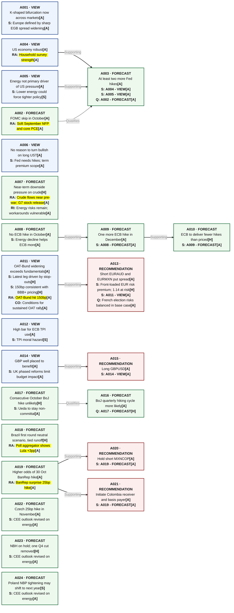

```mermaid
%%{init: {"flowchart": {"htmlLabels": true, "nodeSpacing": 20, "rankSpacing": 60}, "themeCSS": ".arg{width:330px;text-align:left;color:#111111} .core,.c{display:flex;justify-content:space-between;align-items:flex-end;gap:8px;margin-top:4px;padding:3px 6px;color:#111111} .core{border:2px solid} .c{border:1.5px solid;border-radius:10px} .rec{background:#f8c9c9;border-color:#8b1a1a} .val{background:#e3d4f5;border-color:#5b2c8f} .fc{background:#c9ecc9;border-color:#1a6b3a} .view{background:#c9dcf8;border-color:#1a3f8b} .dp{background:#d4d4d4;border-color:#5f5f5f} .obs{background:#e6e6e6;border-color:#888888} mark{background:#e6e6e6;color:#111111;padding:0 2px} .edgeLabel,.edgeLabel *{color:#9a9a9a !important;fill:#9a9a9a !important}"}}%%
flowchart LR
    A001["<div class='arg'><b>A001 · VIEW</b><div class='core view'><span>K-shaped bifurcation now across markets</span><b>[A]</b></div><div class='c view'><span><b>S:</b> Europe defined by sharp EGB spread widening</span><b>[A]</b></div></div>"]
    A002["<div class='arg'><b>A002 · FORECAST</b><div class='core fc'><span>FOMC skip in October</span><b>[A]</b></div><div class='c dp'><span><b>RA:</b> <mark>Soft September NFP and core PCE</mark></span><b>[A]</b></div></div>"]
    A003["<div class='arg'><b>A003 · FORECAST</b><div class='core fc'><span>At least two more Fed hikes</span><b>[A]</b></div><div class='c view'><span><b>S:</b> <b>A004 - VIEW</b></span><b>[A]</b></div><div class='c view'><span><b>S:</b> <b>A005 - VIEW</b></span><b>[A]</b></div><div class='c fc'><span><b>Q:</b> <b>A002 - FORECAST</b></span><b>[A]</b></div></div>"]
    A004["<div class='arg'><b>A004 · VIEW</b><div class='core view'><span>US economy robust</span><b>[A]</b></div><div class='c dp'><span><b>RA:</b> <mark>Household survey strength</mark></span><b>[A]</b></div></div>"]
    A005["<div class='arg'><b>A005 · VIEW</b><div class='core view'><span>Energy not primary driver of US pressure</span><b>[A]</b></div><div class='c view'><span><b>S:</b> Lower energy could force tighter policy</span><b>[S]</b></div></div>"]
    A006["<div class='arg'><b>A006 · VIEW</b><div class='core view'><span>No reason to turn bullish on long UST</span><b>[A]</b></div><div class='c view'><span><b>S:</b> Fed needs hikes; term premium scope</span><b>[A]</b></div></div>"]
    A007["<div class='arg'><b>A007 · FORECAST</b><div class='core fc'><span>Near-term downside pressure on crude</span><b>[H]</b></div><div class='c dp'><span><b>RA:</b> <mark>Crude flows near pre-war; G7 stock release</mark></span><b>[A]</b></div><div class='c view'><span><b>RI:</b> Energy risks remain; workarounds vulnerable</span><b>[A]</b></div></div>"]
    A008["<div class='arg'><b>A008 · FORECAST</b><div class='core fc'><span>No ECB hike in October</span><b>[A]</b></div><div class='c view'><span><b>S:</b> Energy decline helps ECB more</span><b>[A]</b></div></div>"]
    A009["<div class='arg'><b>A009 · FORECAST</b><div class='core fc'><span>One more ECB hike in December</span><b>[A]</b></div><div class='c fc'><span><b>S:</b> <b>A008 - FORECAST</b></span><b>[A]</b></div></div>"]
    A010["<div class='arg'><b>A010 · FORECAST</b><div class='core fc'><span>ECB to deliver fewer hikes than priced</span><b>[H]</b></div><div class='c fc'><span><b>S:</b> <b>A009 - FORECAST</b></span><b>[A]</b></div></div>"]
    A011["<div class='arg'><b>A011 · VIEW</b><div class='core view'><span>OAT-Bund widening exceeds fundamentals</span><b>[A]</b></div><div class='c view'><span><b>S:</b> Latest leg driven by stop-outs</span><b>[H]</b></div><div class='c val'><span><b>S:</b> 150bp consistent with BBB+ pricing</span><b>[H]</b></div><div class='c dp'><span><b>RA:</b> <mark>OAT-Bund hit 150bp</mark></span><b>[A]</b></div><div class='c view'><span><b>CO:</b> Conditions for sustained OAT rally</span><b>[A]</b></div></div>"]
    A012["<div class='arg'><b>A012 · VIEW</b><div class='core view'><span>High bar for ECB TPI use</span><b>[A]</b></div><div class='c view'><span><b>S:</b> TPI moral hazard</span><b>[S]</b></div></div>"]
    A013["<div class='arg'><b>A013 · RECOMMENDATION</b><div class='core rec'><span>Short EURAUD and EURMXN put spread</span><b>[A]</b></div><div class='c fc'><span><b>S:</b> Front-loaded EUR risk premium; 1.14 at risk</span><b>[H]</b></div><div class='c view'><span><b>S:</b> <b>A011 - VIEW</b></span><b>[A]</b></div><div class='c view'><span><b>Q:</b> French election risks balanced in base case</span><b>[A]</b></div></div>"]
    A014["<div class='arg'><b>A014 · VIEW</b><div class='core view'><span>GBP well placed to benefit</span><b>[A]</b></div><div class='c view'><span><b>S:</b> UK phased reforms limit budget impact</span><b>[A]</b></div></div>"]
    A015["<div class='arg'><b>A015 · RECOMMENDATION</b><div class='core rec'><span>Long GBPUSD</span><b>[A]</b></div><div class='c view'><span><b>S:</b> <b>A014 - VIEW</b></span><b>[A]</b></div></div>"]
    A016["<div class='arg'><b>A016 · FORECAST</b><div class='core fc'><span>BoJ quarterly hiking cycle more likely</span><b>[A]</b></div><div class='c fc'><span><b>Q:</b> <b>A017 - FORECAST</b></span><b>[H]</b></div></div>"]
    A017["<div class='arg'><b>A017 · FORECAST</b><div class='core fc'><span>Consecutive October BoJ hike unlikely</span><b>[H]</b></div><div class='c fc'><span><b>S:</b> Ueda to stay non-committal</span><b>[A]</b></div></div>"]
    A018["<div class='arg'><b>A018 · FORECAST</b><div class='core fc'><span>Brazil first round neutral scenario, tied runoff</span><b>[H]</b></div><div class='c dp'><span><b>RA:</b> <mark>Poll aggregator shows Lula +3pp</mark></span><b>[A]</b></div></div>"]
    A019["<div class='arg'><b>A019 · FORECAST</b><div class='core fc'><span>Higher odds of 30 Oct BanRep hike</span><b>[A]</b></div><div class='c dp'><span><b>RA:</b> <mark>BanRep surprise 25bp hike</mark></span><b>[A]</b></div></div>"]
    A020["<div class='arg'><b>A020 · RECOMMENDATION</b><div class='core rec'><span>Hold short MXNCOP</span><b>[A]</b></div><div class='c fc'><span><b>S:</b> <b>A019 - FORECAST</b></span><b>[A]</b></div></div>"]
    A021["<div class='arg'><b>A021 · RECOMMENDATION</b><div class='core rec'><span>Initiate Colombia receiver and basis payer</span><b>[A]</b></div><div class='c fc'><span><b>S:</b> <b>A019 - FORECAST</b></span><b>[A]</b></div></div>"]
    A022["<div class='arg'><b>A022 · FORECAST</b><div class='core fc'><span>Czech 25bp hike in November</span><b>[A]</b></div><div class='c view'><span><b>S:</b> CEE outlook revised on energy</span><b>[A]</b></div></div>"]
    A023["<div class='arg'><b>A023 · FORECAST</b><div class='core fc'><span>NBH on hold; one Q4 cut removed</span><b>[H]</b></div><div class='c view'><span><b>S:</b> CEE outlook revised on energy</span><b>[A]</b></div></div>"]
    A024["<div class='arg'><b>A024 · FORECAST</b><div class='core fc'><span>Poland NBP tightening may shift to next year</span><b>[S]</b></div><div class='c view'><span><b>S:</b> CEE outlook revised on energy</span><b>[A]</b></div></div>"]

    A004 -- Supporting --> A003
    A005 -- Supporting --> A003
    A002 -. Qualifies .-> A003
    A008 -- Supporting --> A009
    A009 -- Supporting --> A010
    A011 -- Supporting --> A013
    A014 -- Supporting --> A015
    A017 -. Qualifies .-> A016
    A019 -- Supporting --> A020
    A019 -- Supporting --> A021

    classDef fc fill:#eef9ee,stroke:#1a6b3a,stroke-width:2px,color:#111111
    classDef rec fill:#fdeeee,stroke:#8b1a1a,stroke-width:2px,color:#111111
    classDef view fill:#eef4fd,stroke:#1a3f8b,stroke-width:2px,color:#111111
    class A002,A003,A007,A008,A009,A010,A016,A017,A018,A019,A022,A023,A024 fc
    class A013,A015,A020,A021 rec
    class A001,A004,A005,A006,A011,A012,A014 view
    linkStyle default stroke:#333333,stroke-width:2px,color:#9a9a9a
```
