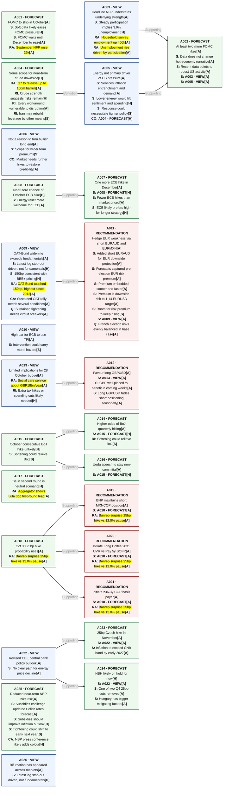

```mermaid
%%{init: {"flowchart": {"htmlLabels": true, "nodeSpacing": 20, "rankSpacing": 60}, "themeCSS": ".arg{width:330px;text-align:left;color:#111111} .core,.c{display:flex;justify-content:space-between;align-items:flex-end;gap:8px;margin-top:4px;padding:3px 6px;color:#111111} .core{border:2px solid} .c{border:1.5px solid;border-radius:10px} .rec{background:#f8c9c9;border-color:#8b1a1a} .val{background:#e3d4f5;border-color:#5b2c8f} .fc{background:#c9ecc9;border-color:#1a6b3a} .view{background:#c9dcf8;border-color:#1a3f8b} .dp{background:#d4d4d4;border-color:#5f5f5f} .obs{background:#e6e6e6;border-color:#888888} mark{background:#e6e6e6;color:#111111;padding:0 2px} .edgeLabel,.edgeLabel *{color:#9a9a9a !important;fill:#9a9a9a !important}"}}%%
flowchart LR
    A001["<div class='arg'><b>A001 · FORECAST</b><div class='core fc'><span>FOMC to skip in October</span><b>[A]</b></div><div class='c view'><span><b>S:</b> Soft data likely eases FOMC pressure</span><b>[H]</b></div><div class='c fc'><span><b>S:</b> FOMC waits until December to ease</span><b>[A]</b></div><div class='c dp'><span><b>RA:</b> <mark>September NFP rose 29k</mark></span><b>[A]</b></div></div>"]
    A002["<div class='arg'><b>A002 · FORECAST</b><div class='core fc'><span>At least two more FOMC hikes</span><b>[A]</b></div><div class='c view'><span><b>S:</b> Data does not change hot-economy narrative</span><b>[A]</b></div><div class='c view'><span><b>S:</b> Recent data points to robust US activity</span><b>[A]</b></div><div class='c view'><span><b>S:</b> <b>A003 - VIEW</b></span><b>[A]</b></div><div class='c view'><span><b>S:</b> <b>A005 - VIEW</b></span><b>[A]</b></div></div>"]
    A003["<div class='arg'><b>A003 · VIEW</b><div class='core view'><span>Headline NFP understates underlying strength</span><b>[A]</b></div><div class='c fc'><span><b>S:</b> Steady participation implies 3.9% unemployment</span><b>[H]</b></div><div class='c dp'><span><b>RA:</b> <mark>Household survey employment up 406k</mark></span><b>[A]</b></div><div class='c dp'><span><b>RA:</b> <mark>Unemployment rise driven by participation</mark></span><b>[A]</b></div></div>"]
    A004["<div class='arg'><b>A004 · FORECAST</b><div class='core fc'><span>Some scope for near-term crude downside</span><b>[H]</b></div><div class='c dp'><span><b>RA:</b> <mark>G7 to release up to 100m barrels</mark></span><b>[A]</b></div><div class='c view'><span><b>RI:</b> Crude strength suggests risks remain</span><b>[H]</b></div><div class='c view'><span><b>RI:</b> Every workaround vulnerable to disruption</span><b>[A]</b></div><div class='c view'><span><b>RI:</b> Iran may rebuild leverage by other means</span><b>[S]</b></div></div>"]
    A005["<div class='arg'><b>A005 · VIEW</b><div class='core view'><span>Energy not primary driver of US pressure</span><b>[A]</b></div><div class='c view'><span><b>S:</b> Services inflation entrenchment and demand</span><b>[A]</b></div><div class='c view'><span><b>S:</b> Lower energy would lift sentiment and spending</span><b>[H]</b></div><div class='c view'><span><b>S:</b> Response could necessitate tighter policy</span><b>[S]</b></div><div class='c fc'><span><b>CO:</b> <b>A004 - FORECAST</b></span><b>[H]</b></div></div>"]
    A006["<div class='arg'><b>A006 · VIEW</b><div class='core view'><span>Not a reason to turn bullish long end</span><b>[A]</b></div><div class='c fc'><span><b>S:</b> Scope for wider term premiums</span><b>[S]</b></div><div class='c view'><span><b>CO:</b> Market needs further hikes to restore credibility</span><b>[A]</b></div></div>"]
    A007["<div class='arg'><b>A007 · FORECAST</b><div class='core fc'><span>One more ECB hike in December</span><b>[A]</b></div><div class='c fc'><span><b>S:</b> <b>A008 - FORECAST</b></span><b>[H]</b></div><div class='c fc'><span><b>S:</b> Fewer ECB hikes than market priced</span><b>[A]</b></div><div class='c fc'><span><b>S:</b> ECB likely prefers high-for-longer strategy</span><b>[H]</b></div></div>"]
    A008["<div class='arg'><b>A008 · FORECAST</b><div class='core fc'><span>Near-zero chance of October ECB hike</span><b>[H]</b></div><div class='c view'><span><b>S:</b> Energy relief more welcome for ECB</span><b>[A]</b></div></div>"]
    A009["<div class='arg'><b>A009 · VIEW</b><div class='core view'><span>OAT-Bund widening exceeds fundamentals</span><b>[A]</b></div><div class='c view'><span><b>S:</b> Latest leg stop-out driven, not fundamentals</span><b>[H]</b></div><div class='c val'><span><b>S:</b> 150bp consistent with BBB+ pricing</span><b>[H]</b></div><div class='c dp'><span><b>RA:</b> <mark>OAT-Bund touched 150bp, highest since 2012</mark></span><b>[A]</b></div><div class='c view'><span><b>CA:</b> Sustained OAT rally needs several conditions</span><b>[A]</b></div><div class='c view'><span><b>Q:</b> Sustained tightening needs circuit breakers</span><b>[A]</b></div></div>"]
    A010["<div class='arg'><b>A010 · VIEW</b><div class='core view'><span>High bar for ECB to use TPI</span><b>[A]</b></div><div class='c view'><span><b>S:</b> Intervention could carry moral hazard</span><b>[S]</b></div></div>"]
    A011["<div class='arg'><b>A011 · RECOMMENDATION</b><div class='core rec'><span>Hedge EUR weakness via short EURAUD and EURMXN</span><b>[A]</b></div><div class='c rec'><span><b>S:</b> Added short EURAUD for EUR downside protection</span><b>[A]</b></div><div class='c view'><span><b>S:</b> Forecasts captured pre-election EUR risk premium</span><b>[A]</b></div><div class='c view'><span><b>S:</b> Premium embedded sooner and faster</span><b>[A]</b></div><div class='c view'><span><b>S:</b> Premium is downside risk to 1.14 EURUSD target</span><b>[A]</b></div><div class='c view'><span><b>S:</b> Room for risk premium to keep rising</span><b>[S]</b></div><div class='c view'><span><b>S:</b> <b>A009 - VIEW</b></span><b>[A]</b></div><div class='c view'><span><b>Q:</b> French election risks evenly balanced in base case</span><b>[A]</b></div></div>"]
    A012["<div class='arg'><b>A012 · RECOMMENDATION</b><div class='core rec'><span>Favour long GBPUSD</span><b>[A]</b></div><div class='c view'><span><b>S:</b> <b>A013 - VIEW</b></span><b>[A]</b></div><div class='c view'><span><b>S:</b> GBP well placed to benefit in coming weeks</span><b>[A]</b></div><div class='c view'><span><b>S:</b> Long GBPUSD fades short positioning seasonally</span><b>[A]</b></div></div>"]
    A013["<div class='arg'><b>A013 · VIEW</b><div class='core view'><span>Limited implications for 28 October budget</span><b>[A]</b></div><div class='c dp'><span><b>RA:</b> <mark>Social care service about GBP18bn/year</mark></span><b>[A]</b></div><div class='c view'><span><b>RI:</b> Extra tax hikes or spending cuts likely needed</span><b>[H]</b></div></div>"]
    A014["<div class='arg'><b>A014 · FORECAST</b><div class='core fc'><span>Higher odds of BoJ quarterly hiking</span><b>[A]</b></div><div class='c fc'><span><b>S:</b> <b>A015 - FORECAST</b></span><b>[H]</b></div><div class='c view'><span><b>RI:</b> Softening could relieve BoJ</span><b>[S]</b></div></div>"]
    A015["<div class='arg'><b>A015 · FORECAST</b><div class='core fc'><span>October consecutive BoJ hike unlikely</span><b>[H]</b></div><div class='c view'><span><b>S:</b> Softening could relieve BoJ</span><b>[S]</b></div></div>"]
    A016["<div class='arg'><b>A016 · FORECAST</b><div class='core fc'><span>Ueda speech to stay non-committal</span><b>[A]</b></div><div class='c fc'><span><b>S:</b> <b>A015 - FORECAST</b></span><b>[H]</b></div></div>"]
    A017["<div class='arg'><b>A017 · FORECAST</b><div class='core fc'><span>Tie in second round is neutral scenario</span><b>[H]</b></div><div class='c dp'><span><b>RA:</b> <mark>Aggregator shows Lula 3pp first-round lead</mark></span><b>[A]</b></div></div>"]
    A018["<div class='arg'><b>A018 · FORECAST</b><div class='core fc'><span>Oct 30 25bp hike probability rises</span><b>[A]</b></div><div class='c dp'><span><b>RA:</b> <mark>Banrep surprise 25bp hike vs 12.0% pause</mark></span><b>[A]</b></div></div>"]
    A019["<div class='arg'><b>A019 · RECOMMENDATION</b><div class='core rec'><span>BNP maintains short MXNCOP position</span><b>[A]</b></div><div class='c fc'><span><b>S:</b> <b>A018 - FORECAST</b></span><b>[A]</b></div><div class='c dp'><span><b>RA:</b> <mark>Banrep surprise 25bp hike vs 12.0% pause</mark></span><b>[A]</b></div></div>"]
    A020["<div class='arg'><b>A020 · RECOMMENDATION</b><div class='core rec'><span>Initiate Long Coltes 2031 UVR vs Pay 5y SOFR</span><b>[A]</b></div><div class='c fc'><span><b>S:</b> <b>A018 - FORECAST</b></span><b>[A]</b></div><div class='c dp'><span><b>RA:</b> <mark>Banrep surprise 25bp hike vs 12.0% pause</mark></span><b>[A]</b></div></div>"]
    A021["<div class='arg'><b>A021 · RECOMMENDATION</b><div class='core rec'><span>Initiate z36-3y COP basis payer</span><b>[A]</b></div><div class='c fc'><span><b>S:</b> <b>A018 - FORECAST</b></span><b>[A]</b></div><div class='c dp'><span><b>RA:</b> <mark>Banrep surprise 25bp hike vs 12.0% pause</mark></span><b>[A]</b></div></div>"]
    A022["<div class='arg'><b>A022 · VIEW</b><div class='core view'><span>Revised CEE central bank policy outlook</span><b>[A]</b></div><div class='c view'><span><b>S:</b> No clear path for energy price decline</span><b>[A]</b></div></div>"]
    A023["<div class='arg'><b>A023 · FORECAST</b><div class='core fc'><span>25bp Czech hike in November</span><b>[A]</b></div><div class='c view'><span><b>S:</b> <b>A022 - VIEW</b></span><b>[A]</b></div><div class='c fc'><span><b>S:</b> Inflation to exceed CNB band by early 2027</span><b>[A]</b></div></div>"]
    A024["<div class='arg'><b>A024 · FORECAST</b><div class='core fc'><span>NBH likely on hold for now</span><b>[H]</b></div><div class='c view'><span><b>S:</b> <b>A022 - VIEW</b></span><b>[A]</b></div><div class='c fc'><span><b>S:</b> One of two Q4 25bp cuts removed</span><b>[A]</b></div><div class='c view'><span><b>S:</b> Hungary has bigger mitigating factors</span><b>[A]</b></div></div>"]
    A025["<div class='arg'><b>A025 · FORECAST</b><div class='core fc'><span>Reduced near-term NBP hike risk</span><b>[A]</b></div><div class='c view'><span><b>S:</b> Subsidies challenge updated Polish rates forecast</span><b>[A]</b></div><div class='c fc'><span><b>S:</b> Subsidies should improve inflation outlook</span><b>[H]</b></div><div class='c fc'><span><b>S:</b> Tightening could shift to early next year</span><b>[S]</b></div><div class='c fc'><span><b>CA:</b> NBP press conference likely adds colour</span><b>[H]</b></div></div>"]
    A026["<div class='arg'><b>A026 · VIEW</b><div class='core view'><span>Bifurcation has appeared across markets</span><b>[A]</b></div><div class='c view'><span><b>S:</b> Latest leg stop-out driven, not fundamentals</span><b>[H]</b></div></div>"]

    A003 -- Supporting --> A002
    A005 -- Supporting --> A002
    A004 -- Condition --> A005
    A008 -- Supporting --> A007
    A009 -- Supporting --> A011
    A013 -- Supporting --> A012
    A015 -- Supporting --> A014
    A015 -- Supporting --> A016
    A018 -- Supporting --> A019
    A018 -- Supporting --> A020
    A018 -- Supporting --> A021
    A022 -- Supporting --> A023
    A022 -- Supporting --> A024

    classDef fc fill:#eef9ee,stroke:#1a6b3a,stroke-width:2px,color:#111111
    classDef rec fill:#fdeeee,stroke:#8b1a1a,stroke-width:2px,color:#111111
    classDef view fill:#eef4fd,stroke:#1a3f8b,stroke-width:2px,color:#111111
    class A001,A002,A004,A007,A008,A014,A015,A016,A017,A018,A023,A024,A025 fc
    class A011,A012,A019,A020,A021 rec
    class A003,A005,A006,A009,A010,A013,A022,A026 view
    linkStyle default stroke:#333333,stroke-width:2px,color:#9a9a9a
```
