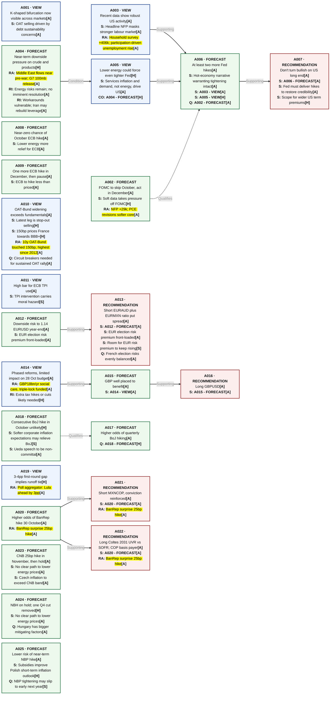

```mermaid
%%{init: {"flowchart": {"htmlLabels": true, "nodeSpacing": 20, "rankSpacing": 60}, "themeCSS": ".arg{width:330px;text-align:left;color:#111111} .core,.c{display:flex;justify-content:space-between;align-items:flex-end;gap:8px;margin-top:4px;padding:3px 6px;color:#111111} .core{border:2px solid} .c{border:1.5px solid;border-radius:10px} .rec{background:#f8c9c9;border-color:#8b1a1a} .val{background:#e3d4f5;border-color:#5b2c8f} .fc{background:#c9ecc9;border-color:#1a6b3a} .view{background:#c9dcf8;border-color:#1a3f8b} .dp{background:#d4d4d4;border-color:#5f5f5f} .obs{background:#e6e6e6;border-color:#888888} mark{background:#e6e6e6;color:#111111;padding:0 2px} .edgeLabel,.edgeLabel *{color:#9a9a9a !important;fill:#9a9a9a !important}"}}%%
flowchart LR
    A001["<div class='arg'><b>A001 · VIEW</b><div class='core view'><span>K-shaped bifurcation now visible across markets</span><b>[A]</b></div><div class='c view'><span><b>S:</b> OAT selling driven by debt sustainability concerns</span><b>[A]</b></div></div>"]
    A002["<div class='arg'><b>A002 · FORECAST</b><div class='core fc'><span>FOMC to skip October, act in December</span><b>[A]</b></div><div class='c view'><span><b>S:</b> Soft data takes pressure off FOMC</span><b>[H]</b></div><div class='c dp'><span><b>RA:</b> <mark>NFP +29k; PCE revisions softer core</mark></span><b>[A]</b></div></div>"]
    A003["<div class='arg'><b>A003 · VIEW</b><div class='core view'><span>Recent data show robust US activity</span><b>[A]</b></div><div class='c view'><span><b>S:</b> Headline NFP masks stronger labour market</span><b>[A]</b></div><div class='c dp'><span><b>RA:</b> <mark>Household survey +406k; participation-driven unemployment rise</mark></span><b>[A]</b></div></div>"]
    A004["<div class='arg'><b>A004 · FORECAST</b><div class='core fc'><span>Near-term downside pressure on crude and products</span><b>[H]</b></div><div class='c dp'><span><b>RA:</b> <mark>Middle East flows near pre-war; G7 100mb release</mark></span><b>[A]</b></div><div class='c view'><span><b>RI:</b> Energy risks remain; no imminent resolution</span><b>[A]</b></div><div class='c view'><span><b>RI:</b> Workarounds vulnerable; Iran may rebuild leverage</span><b>[A]</b></div></div>"]
    A005["<div class='arg'><b>A005 · VIEW</b><div class='core view'><span>Lower energy could force even tighter Fed</span><b>[H]</b></div><div class='c view'><span><b>S:</b> Services inflation and demand, not energy, drive US</span><b>[A]</b></div><div class='c fc'><span><b>CO:</b> <b>A004 - FORECAST</b></span><b>[H]</b></div></div>"]
    A006["<div class='arg'><b>A006 · FORECAST</b><div class='core fc'><span>At least two more Fed hikes</span><b>[A]</b></div><div class='c view'><span><b>S:</b> Hot-economy narrative warranting tightening intact</span><b>[A]</b></div><div class='c view'><span><b>S:</b> <b>A003 - VIEW</b></span><b>[A]</b></div><div class='c view'><span><b>S:</b> <b>A005 - VIEW</b></span><b>[H]</b></div><div class='c fc'><span><b>Q:</b> <b>A002 - FORECAST</b></span><b>[A]</b></div></div>"]
    A007["<div class='arg'><b>A007 · RECOMMENDATION</b><div class='core rec'><span>Don't turn bullish on US long end</span><b>[A]</b></div><div class='c fc'><span><b>S:</b> <b>A006 - FORECAST</b></span><b>[A]</b></div><div class='c view'><span><b>S:</b> Fed must deliver hikes to restore credibility</span><b>[A]</b></div><div class='c fc'><span><b>S:</b> Scope for wider US term premiums</span><b>[H]</b></div></div>"]
    A008["<div class='arg'><b>A008 · FORECAST</b><div class='core fc'><span>Near-zero chance of October ECB hike</span><b>[A]</b></div><div class='c view'><span><b>S:</b> Lower energy more relief for ECB</span><b>[A]</b></div></div>"]
    A009["<div class='arg'><b>A009 · FORECAST</b><div class='core fc'><span>One more ECB hike in December, then pause</span><b>[A]</b></div><div class='c fc'><span><b>S:</b> ECB to hike less than priced</span><b>[A]</b></div></div>"]
    A010["<div class='arg'><b>A010 · VIEW</b><div class='core view'><span>OAT-Bund widening exceeds fundamentals</span><b>[A]</b></div><div class='c view'><span><b>S:</b> Latest leg is stop-out selling</span><b>[H]</b></div><div class='c val'><span><b>S:</b> 150bp prices France towards BBB+</span><b>[H]</b></div><div class='c dp'><span><b>RA:</b> <mark>10y OAT-Bund touched 150bp, highest since 2012</mark></span><b>[A]</b></div><div class='c view'><span><b>Q:</b> Circuit breakers needed for sustained OAT rally</span><b>[A]</b></div></div>"]
    A011["<div class='arg'><b>A011 · VIEW</b><div class='core view'><span>High bar for ECB TPI use</span><b>[A]</b></div><div class='c view'><span><b>S:</b> TPI intervention carries moral hazard</span><b>[S]</b></div></div>"]
    A012["<div class='arg'><b>A012 · FORECAST</b><div class='core fc'><span>Downside risk to 1.14 EURUSD year-end</span><b>[A]</b></div><div class='c view'><span><b>S:</b> EUR election risk premium front-loaded</span><b>[A]</b></div></div>"]
    A013["<div class='arg'><b>A013 · RECOMMENDATION</b><div class='core rec'><span>Short EURAUD plus EURMXN ratio put spread</span><b>[A]</b></div><div class='c fc'><span><b>S:</b> <b>A012 - FORECAST</b></span><b>[A]</b></div><div class='c view'><span><b>S:</b> EUR election risk premium front-loaded</span><b>[A]</b></div><div class='c view'><span><b>S:</b> Room for EUR risk premium to keep rising</span><b>[S]</b></div><div class='c view'><span><b>Q:</b> French election risks evenly balanced</span><b>[A]</b></div></div>"]
    A014["<div class='arg'><b>A014 · VIEW</b><div class='core view'><span>Phased reforms, limited impact on 28 Oct budget</span><b>[A]</b></div><div class='c dp'><span><b>RA:</b> <mark>GBP18bn/yr social care, triple-lock funded</mark></span><b>[A]</b></div><div class='c fc'><span><b>RI:</b> Extra tax hikes or cuts likely needed</span><b>[H]</b></div></div>"]
    A015["<div class='arg'><b>A015 · FORECAST</b><div class='core fc'><span>GBP well placed to benefit</span><b>[A]</b></div><div class='c view'><span><b>S:</b> <b>A014 - VIEW</b></span><b>[A]</b></div></div>"]
    A016["<div class='arg'><b>A016 · RECOMMENDATION</b><div class='core rec'><span>Long GBPUSD</span><b>[A]</b></div><div class='c fc'><span><b>S:</b> <b>A015 - FORECAST</b></span><b>[A]</b></div></div>"]
    A017["<div class='arg'><b>A017 · FORECAST</b><div class='core fc'><span>Higher odds of quarterly BoJ hiking</span><b>[A]</b></div><div class='c fc'><span><b>Q:</b> <b>A018 - FORECAST</b></span><b>[H]</b></div></div>"]
    A018["<div class='arg'><b>A018 · FORECAST</b><div class='core fc'><span>Consecutive BoJ hike in October unlikely</span><b>[H]</b></div><div class='c view'><span><b>S:</b> Softer corporate inflation expectations may relieve BoJ</span><b>[S]</b></div><div class='c fc'><span><b>S:</b> Ueda speech to be non-committal</span><b>[A]</b></div></div>"]
    A019["<div class='arg'><b>A019 · VIEW</b><div class='core view'><span>3-4pp first-round gap implies runoff tie</span><b>[H]</b></div><div class='c dp'><span><b>RA:</b> <mark>Poll aggregator: Lula ahead by 3pp</mark></span><b>[A]</b></div></div>"]
    A020["<div class='arg'><b>A020 · FORECAST</b><div class='core fc'><span>Higher odds of BanRep hike 30 October</span><b>[A]</b></div><div class='c dp'><span><b>RA:</b> <mark>BanRep surprise 25bp hike</mark></span><b>[A]</b></div></div>"]
    A021["<div class='arg'><b>A021 · RECOMMENDATION</b><div class='core rec'><span>Short MXNCOP, conviction reinforced</span><b>[A]</b></div><div class='c fc'><span><b>S:</b> <b>A020 - FORECAST</b></span><b>[A]</b></div><div class='c dp'><span><b>RA:</b> <mark>BanRep surprise 25bp hike</mark></span><b>[A]</b></div></div>"]
    A022["<div class='arg'><b>A022 · RECOMMENDATION</b><div class='core rec'><span>Long Coltes 2031 UVR vs SOFR; COP basis payer</span><b>[A]</b></div><div class='c fc'><span><b>S:</b> <b>A020 - FORECAST</b></span><b>[A]</b></div><div class='c dp'><span><b>RA:</b> <mark>BanRep surprise 25bp hike</mark></span><b>[A]</b></div></div>"]
    A023["<div class='arg'><b>A023 · FORECAST</b><div class='core fc'><span>CNB 25bp hike in November, then hold</span><b>[A]</b></div><div class='c view'><span><b>S:</b> No clear path to lower energy prices</span><b>[A]</b></div><div class='c fc'><span><b>S:</b> Czech inflation to exceed CNB band</span><b>[A]</b></div></div>"]
    A024["<div class='arg'><b>A024 · FORECAST</b><div class='core fc'><span>NBH on hold; one Q4 cut removed</span><b>[H]</b></div><div class='c view'><span><b>S:</b> No clear path to lower energy prices</span><b>[A]</b></div><div class='c view'><span><b>Q:</b> Hungary has bigger mitigating factors</span><b>[A]</b></div></div>"]
    A025["<div class='arg'><b>A025 · FORECAST</b><div class='core fc'><span>Lower risk of near-term NBP hike</span><b>[A]</b></div><div class='c fc'><span><b>S:</b> Subsidies improve Polish short-term inflation outlook</span><b>[H]</b></div><div class='c fc'><span><b>Q:</b> NBP tightening may slip to early next year</span><b>[S]</b></div></div>"]

    A004 -- Condition --> A005
    A003 -- Supporting --> A006
    A005 -- Supporting --> A006
    A002 -. Qualifies .-> A006
    A006 -- Supporting --> A007
    A012 -- Supporting --> A013
    A014 -- Supporting --> A015
    A015 -- Supporting --> A016
    A018 -. Qualifies .-> A017
    A020 -- Supporting --> A021
    A020 -- Supporting --> A022

    classDef fc fill:#eef9ee,stroke:#1a6b3a,stroke-width:2px,color:#111111
    classDef rec fill:#fdeeee,stroke:#8b1a1a,stroke-width:2px,color:#111111
    classDef view fill:#eef4fd,stroke:#1a3f8b,stroke-width:2px,color:#111111
    class A002,A004,A006,A008,A009,A012,A015,A017,A018,A020,A023,A024,A025 fc
    class A007,A013,A016,A021,A022 rec
    class A001,A003,A005,A010,A011,A014,A019 view
    linkStyle default stroke:#333333,stroke-width:2px,color:#9a9a9a
```
