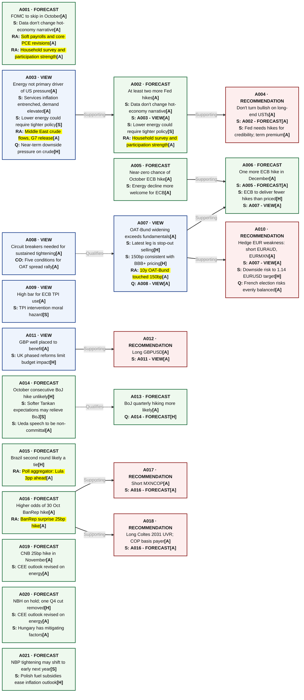

```mermaid
%%{init: {"flowchart": {"htmlLabels": true, "nodeSpacing": 20, "rankSpacing": 60}, "themeCSS": ".arg{width:330px;text-align:left;color:#111111} .core,.c{display:flex;justify-content:space-between;align-items:flex-end;gap:8px;margin-top:4px;padding:3px 6px;color:#111111} .core{border:2px solid} .c{border:1.5px solid;border-radius:10px} .rec{background:#f8c9c9;border-color:#8b1a1a} .val{background:#e3d4f5;border-color:#5b2c8f} .fc{background:#c9ecc9;border-color:#1a6b3a} .view{background:#c9dcf8;border-color:#1a3f8b} .dp{background:#d4d4d4;border-color:#5f5f5f} .obs{background:#e6e6e6;border-color:#888888} mark{background:#e6e6e6;color:#111111;padding:0 2px} .edgeLabel,.edgeLabel *{color:#9a9a9a !important;fill:#9a9a9a !important}"}}%%
flowchart LR
    A001["<div class='arg'><b>A001 · FORECAST</b><div class='core fc'><span>FOMC to skip in October</span><b>[A]</b></div><div class='c view'><span><b>S:</b> Data don't change hot-economy narrative</span><b>[A]</b></div><div class='c dp'><span><b>RA:</b> <mark>Soft payrolls and core PCE revisions</mark></span><b>[A]</b></div><div class='c dp'><span><b>RA:</b> <mark>Household survey and participation strength</mark></span><b>[A]</b></div></div>"]
    A002["<div class='arg'><b>A002 · FORECAST</b><div class='core fc'><span>At least two more Fed hikes</span><b>[A]</b></div><div class='c view'><span><b>S:</b> Data don't change hot-economy narrative</span><b>[A]</b></div><div class='c view'><span><b>S:</b> <b>A003 - VIEW</b></span><b>[A]</b></div><div class='c view'><span><b>S:</b> Lower energy could require tighter policy</span><b>[S]</b></div><div class='c dp'><span><b>RA:</b> <mark>Household survey and participation strength</mark></span><b>[A]</b></div></div>"]
    A003["<div class='arg'><b>A003 · VIEW</b><div class='core view'><span>Energy not primary driver of US pressure</span><b>[A]</b></div><div class='c view'><span><b>S:</b> Services inflation entrenched, demand elevated</span><b>[A]</b></div><div class='c view'><span><b>S:</b> Lower energy could require tighter policy</span><b>[S]</b></div><div class='c dp'><span><b>RA:</b> <mark>Middle East crude flows, G7 release</mark></span><b>[A]</b></div><div class='c fc'><span><b>Q:</b> Near-term downside pressure on crude</span><b>[H]</b></div></div>"]
    A004["<div class='arg'><b>A004 · RECOMMENDATION</b><div class='core rec'><span>Don't turn bullish on long-end USTs</span><b>[A]</b></div><div class='c fc'><span><b>S:</b> <b>A002 - FORECAST</b></span><b>[A]</b></div><div class='c view'><span><b>S:</b> Fed needs hikes for credibility; term premium</span><b>[A]</b></div></div>"]
    A005["<div class='arg'><b>A005 · FORECAST</b><div class='core fc'><span>Near-zero chance of October ECB hike</span><b>[A]</b></div><div class='c view'><span><b>S:</b> Energy decline more welcome for ECB</span><b>[A]</b></div></div>"]
    A006["<div class='arg'><b>A006 · FORECAST</b><div class='core fc'><span>One more ECB hike in December</span><b>[A]</b></div><div class='c fc'><span><b>S:</b> <b>A005 - FORECAST</b></span><b>[A]</b></div><div class='c fc'><span><b>S:</b> ECB to deliver fewer hikes than priced</span><b>[H]</b></div><div class='c view'><span><b>S:</b> <b>A007 - VIEW</b></span><b>[A]</b></div></div>"]
    A007["<div class='arg'><b>A007 · VIEW</b><div class='core view'><span>OAT-Bund widening exceeds fundamentals</span><b>[A]</b></div><div class='c view'><span><b>S:</b> Latest leg is stop-out selling</span><b>[H]</b></div><div class='c val'><span><b>S:</b> 150bp consistent with BBB+ pricing</span><b>[H]</b></div><div class='c dp'><span><b>RA:</b> <mark>10y OAT-Bund touched 150bp</mark></span><b>[A]</b></div><div class='c view'><span><b>Q:</b> <b>A008 - VIEW</b></span><b>[A]</b></div></div>"]
    A008["<div class='arg'><b>A008 · VIEW</b><div class='core view'><span>Circuit breakers needed for sustained tightening</span><b>[A]</b></div><div class='c view'><span><b>CO:</b> Five conditions for OAT spread rally</span><b>[A]</b></div></div>"]
    A009["<div class='arg'><b>A009 · VIEW</b><div class='core view'><span>High bar for ECB TPI use</span><b>[A]</b></div><div class='c view'><span><b>S:</b> TPI intervention moral hazard</span><b>[S]</b></div></div>"]
    A010["<div class='arg'><b>A010 · RECOMMENDATION</b><div class='core rec'><span>Hedge EUR weakness: short EURAUD, EURMXN</span><b>[A]</b></div><div class='c view'><span><b>S:</b> <b>A007 - VIEW</b></span><b>[A]</b></div><div class='c fc'><span><b>S:</b> Downside risk to 1.14 EURUSD target</span><b>[H]</b></div><div class='c view'><span><b>Q:</b> French election risks evenly balanced</span><b>[A]</b></div></div>"]
    A011["<div class='arg'><b>A011 · VIEW</b><div class='core view'><span>GBP well placed to benefit</span><b>[A]</b></div><div class='c view'><span><b>S:</b> UK phased reforms limit budget impact</span><b>[H]</b></div></div>"]
    A012["<div class='arg'><b>A012 · RECOMMENDATION</b><div class='core rec'><span>Long GBPUSD</span><b>[A]</b></div><div class='c view'><span><b>S:</b> <b>A011 - VIEW</b></span><b>[A]</b></div></div>"]
    A013["<div class='arg'><b>A013 · FORECAST</b><div class='core fc'><span>BoJ quarterly hiking more likely</span><b>[A]</b></div><div class='c fc'><span><b>Q:</b> <b>A014 - FORECAST</b></span><b>[H]</b></div></div>"]
    A014["<div class='arg'><b>A014 · FORECAST</b><div class='core fc'><span>October consecutive BoJ hike unlikely</span><b>[H]</b></div><div class='c view'><span><b>S:</b> Softer Tankan expectations may relieve BoJ</span><b>[S]</b></div><div class='c fc'><span><b>S:</b> Ueda speech to be non-committal</span><b>[A]</b></div></div>"]
    A015["<div class='arg'><b>A015 · FORECAST</b><div class='core fc'><span>Brazil second round likely a tie</span><b>[H]</b></div><div class='c dp'><span><b>RA:</b> <mark>Poll aggregator: Lula 3pp ahead</mark></span><b>[A]</b></div></div>"]
    A016["<div class='arg'><b>A016 · FORECAST</b><div class='core fc'><span>Higher odds of 30 Oct BanRep hike</span><b>[A]</b></div><div class='c dp'><span><b>RA:</b> <mark>BanRep surprise 25bp hike</mark></span><b>[A]</b></div></div>"]
    A017["<div class='arg'><b>A017 · RECOMMENDATION</b><div class='core rec'><span>Short MXNCOP</span><b>[A]</b></div><div class='c fc'><span><b>S:</b> <b>A016 - FORECAST</b></span><b>[A]</b></div></div>"]
    A018["<div class='arg'><b>A018 · RECOMMENDATION</b><div class='core rec'><span>Long Coltes 2031 UVR; COP basis payer</span><b>[A]</b></div><div class='c fc'><span><b>S:</b> <b>A016 - FORECAST</b></span><b>[A]</b></div></div>"]
    A019["<div class='arg'><b>A019 · FORECAST</b><div class='core fc'><span>CNB 25bp hike in November</span><b>[A]</b></div><div class='c view'><span><b>S:</b> CEE outlook revised on energy</span><b>[A]</b></div></div>"]
    A020["<div class='arg'><b>A020 · FORECAST</b><div class='core fc'><span>NBH on hold; one Q4 cut removed</span><b>[H]</b></div><div class='c view'><span><b>S:</b> CEE outlook revised on energy</span><b>[A]</b></div><div class='c view'><span><b>S:</b> Hungary has mitigating factors</span><b>[A]</b></div></div>"]
    A021["<div class='arg'><b>A021 · FORECAST</b><div class='core fc'><span>NBP tightening may shift to early next year</span><b>[S]</b></div><div class='c view'><span><b>S:</b> Polish fuel subsidies ease inflation outlook</span><b>[H]</b></div></div>"]

    A003 -- Supporting --> A002
    A002 -- Supporting --> A004
    A005 -- Supporting --> A006
    A007 -- Supporting --> A006
    A008 -. Qualifies .-> A007
    A007 -- Supporting --> A010
    A011 -- Supporting --> A012
    A014 -. Qualifies .-> A013
    A016 -- Supporting --> A017
    A016 -- Supporting --> A018

    classDef fc fill:#eef9ee,stroke:#1a6b3a,stroke-width:2px,color:#111111
    classDef rec fill:#fdeeee,stroke:#8b1a1a,stroke-width:2px,color:#111111
    classDef view fill:#eef4fd,stroke:#1a3f8b,stroke-width:2px,color:#111111
    class A001,A002,A005,A006,A013,A014,A015,A016,A019,A020,A021 fc
    class A004,A010,A012,A017,A018 rec
    class A003,A007,A008,A009,A011 view
    linkStyle default stroke:#333333,stroke-width:2px,color:#9a9a9a
```
