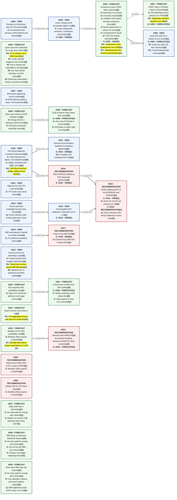

```mermaid
%%{init: {"flowchart": {"htmlLabels": true, "nodeSpacing": 20, "rankSpacing": 60}, "themeCSS": ".arg{width:330px;text-align:left;color:#111111} .core,.c{display:flex;justify-content:space-between;align-items:flex-end;gap:8px;margin-top:4px;padding:3px 6px;color:#111111} .core{border:2px solid} .c{border:1.5px solid;border-radius:10px} .rec{background:#f8c9c9;border-color:#8b1a1a} .val{background:#e3d4f5;border-color:#5b2c8f} .fc{background:#c9ecc9;border-color:#1a6b3a} .view{background:#c9dcf8;border-color:#1a3f8b} .dp{background:#d4d4d4;border-color:#5f5f5f} .obs{background:#e6e6e6;border-color:#888888} mark{background:#e6e6e6;color:#111111;padding:0 2px} .edgeLabel,.edgeLabel *{color:#9a9a9a !important;fill:#9a9a9a !important}"}}%%
flowchart LR
    A001["<div class='arg'><b>A001 · FORECAST</b><div class='core fc'><span>FOMC skips in October, waits to December</span><b>[A]</b></div><div class='c view'><span><b>S:</b> Soft data likely eases pressure on FOMC</span><b>[H]</b></div><div class='c dp'><span><b>RA:</b> <mark>September nonfarm payrolls rose 29k</mark></span><b>[A]</b></div><div class='c fc'><span><b>Q:</b> <b>A002 - FORECAST</b></span><b>[A]</b></div></div>"]
    A002["<div class='arg'><b>A002 · FORECAST</b><div class='core fc'><span>At least two more FOMC hikes expected</span><b>[A]</b></div><div class='c view'><span><b>S:</b> Data does not change hot-economy narrative</span><b>[A]</b></div><div class='c view'><span><b>S:</b> Headline NFP belied stronger underlying picture</span><b>[A]</b></div><div class='c view'><span><b>S:</b> Recent data points to robust US activity</span><b>[A]</b></div><div class='c fc'><span><b>S:</b> Unemployment would be 3.9% with steady participation</span><b>[H]</b></div><div class='c view'><span><b>S:</b> <b>A003 - VIEW</b></span><b>[S]</b></div><div class='c dp'><span><b>RA:</b> <mark>Household survey employment rose 406k</mark></span><b>[A]</b></div><div class='c dp'><span><b>RA:</b> <mark>Unemployment rise driven by participation</mark></span><b>[A]</b></div></div>"]
    A003["<div class='arg'><b>A003 · VIEW</b><div class='core view'><span>Lower energy could necessitate tighter Fed</span><b>[S]</b></div><div class='c view'><span><b>S:</b> Lower energy lifts sentiment, investment, consumption</span><b>[H]</b></div><div class='c view'><span><b>S:</b> <b>A004 - VIEW</b></span><b>[A]</b></div></div>"]
    A004["<div class='arg'><b>A004 · VIEW</b><div class='core view'><span>Energy not the primary driver of US pressure</span><b>[A]</b></div><div class='c view'><span><b>S:</b> US pressure from services entrenchment and demand</span><b>[A]</b></div></div>"]
    A005["<div class='arg'><b>A005 · FORECAST</b><div class='core fc'><span>Some near-term downside for crude and products</span><b>[H]</b></div><div class='c dp'><span><b>RA:</b> <mark>G7 to release up to 100m barrels</mark></span><b>[A]</b></div><div class='c view'><span><b>RI:</b> Crude strength suggests risks remain</span><b>[H]</b></div><div class='c view'><span><b>RI:</b> Every workaround vulnerable to disruption</span><b>[A]</b></div><div class='c view'><span><b>RI:</b> Iran may rebuild leverage via other means</span><b>[S]</b></div><div class='c view'><span><b>RI:</b> Diesel ban speculation props up product prices</span><b>[A]</b></div></div>"]
    A006["<div class='arg'><b>A006 · VIEW</b><div class='core view'><span>Long-end relief not a reason to turn bullish</span><b>[A]</b></div><div class='c fc'><span><b>S:</b> <b>A002 - FORECAST</b></span><b>[A]</b></div><div class='c fc'><span><b>RI:</b> Scope for wider US term premiums</span><b>[S]</b></div><div class='c view'><span><b>CO:</b> Fiscal fundamentals unchanged</span><b>[A]</b></div></div>"]
    A007["<div class='arg'><b>A007 · VIEW</b><div class='core view'><span>Bifurcation appearing across markets</span><b>[A]</b></div><div class='c view'><span><b>S:</b> EGB widening defines week, not broad sell-off</span><b>[A]</b></div></div>"]
    A008["<div class='arg'><b>A008 · FORECAST</b><div class='core fc'><span>Near-zero chance of ECB October hike</span><b>[H]</b></div><div class='c view'><span><b>S:</b> Energy decline a welcome relief for ECB</span><b>[A]</b></div><div class='c view'><span><b>S:</b> ECB price pressures externally driven</span><b>[A]</b></div></div>"]
    A009["<div class='arg'><b>A009 · FORECAST</b><div class='core fc'><span>ECB to deliver fewer hikes than priced</span><b>[A]</b></div><div class='c fc'><span><b>S:</b> <b>A008 - FORECAST</b></span><b>[H]</b></div><div class='c fc'><span><b>S:</b> One more ECB hike in December</span><b>[A]</b></div><div class='c fc'><span><b>S:</b> ECB likely to prefer high-for-longer</span><b>[H]</b></div></div>"]
    A010["<div class='arg'><b>A010 · VIEW</b><div class='core view'><span>OAT-Bund widening exceeds fundamentals</span><b>[A]</b></div><div class='c view'><span><b>S:</b> Latest leg stop-out-driven, not fundamentals</span><b>[H]</b></div><div class='c val'><span><b>S:</b> 150bp consistent with BBB+ pricing</span><b>[A]</b></div><div class='c dp'><span><b>RA:</b> <mark>OAT-Bund touched 150bp, highest since 2012</mark></span><b>[A]</b></div></div>"]
    A011["<div class='arg'><b>A011 · VIEW</b><div class='core view'><span>Several circuit breakers needed for sustained tightening</span><b>[A]</b></div><div class='c view'><span><b>S:</b> <b>A010 - VIEW</b></span><b>[A]</b></div><div class='c view'><span><b>CO:</b> Conditions for sustained OAT rally</span><b>[A]</b></div></div>"]
    A012["<div class='arg'><b>A012 · VIEW</b><div class='core view'><span>High bar for ECB TPI intervention</span><b>[A]</b></div><div class='c view'><span><b>S:</b> TPI could carry moral hazard</span><b>[S]</b></div></div>"]
    A013["<div class='arg'><b>A013 · VIEW</b><div class='core view'><span>Front-loaded EUR weakness: downside risk to 1.14</span><b>[A]</b></div><div class='c view'><span><b>S:</b> <b>A014 - VIEW</b></span><b>[A]</b></div></div>"]
    A014["<div class='arg'><b>A014 · VIEW</b><div class='core view'><span>French premium embedded sooner than thought</span><b>[A]</b></div><div class='c view'><span><b>Q:</b> French election risks evenly balanced in base case</span><b>[A]</b></div></div>"]
    A015["<div class='arg'><b>A015 · RECOMMENDATION</b><div class='core rec'><span>Prefer hedging EUR via short EURAUD and EURMXN</span><b>[A]</b></div><div class='c view'><span><b>S:</b> <b>A013 - VIEW</b></span><b>[A]</b></div><div class='c view'><span><b>S:</b> Room for French risk premium to rise</span><b>[H]</b></div><div class='c rec'><span><b>S:</b> <b>A016 - RECOMMENDATION</b></span><b>[A]</b></div><div class='c view'><span><b>Q:</b> French election risks evenly balanced in base case</span><b>[A]</b></div></div>"]
    A016["<div class='arg'><b>A016 · RECOMMENDATION</b><div class='core rec'><span>Short EURAUD added as EUR downside protection</span><b>[A]</b></div><div class='c view'><span><b>S:</b> <b>A010 - VIEW</b></span><b>[A]</b></div></div>"]
    A017["<div class='arg'><b>A017 · RECOMMENDATION</b><div class='core rec'><span>Favour long GBPUSD</span><b>[A]</b></div><div class='c view'><span><b>S:</b> <b>A018 - VIEW</b></span><b>[A]</b></div><div class='c rec'><span><b>S:</b> Entered long GBPUSD to fade shorts</span><b>[A]</b></div></div>"]
    A018["<div class='arg'><b>A018 · VIEW</b><div class='core view'><span>GBP well placed to benefit in coming weeks</span><b>[A]</b></div><div class='c view'><span><b>S:</b> UK political uncertainty reduced</span><b>[A]</b></div></div>"]
    A019["<div class='arg'><b>A019 · VIEW</b><div class='core view'><span>Fiscal concern not extending to gilts</span><b>[A]</b></div><div class='c view'><span><b>S:</b> Phased reforms limit budget implications</span><b>[A]</b></div><div class='c dp'><span><b>RA:</b> <mark>Social care service about GBP18bn/year</mark></span><b>[A]</b></div><div class='c view'><span><b>RI:</b> Additional tax or spending cuts likely needed</span><b>[H]</b></div></div>"]
    A020["<div class='arg'><b>A020 · FORECAST</b><div class='core fc'><span>BoJ quarterly hike probability rises</span><b>[A]</b></div><div class='c view'><span><b>S:</b> Tokyo CPI confirmed spillovers and wage services</span><b>[A]</b></div></div>"]
    A021["<div class='arg'><b>A021 · FORECAST</b><div class='core fc'><span>Consecutive October BoJ hike unlikely</span><b>[H]</b></div><div class='c fc'><span><b>S:</b> <b>A020 - FORECAST</b></span><b>[A]</b></div><div class='c view'><span><b>S:</b> Tankan softening could relieve BoJ</span><b>[S]</b></div><div class='c fc'><span><b>S:</b> Ueda speech to stay non-committal</span><b>[A]</b></div></div>"]
    A022["<div class='arg'><b>A022 · FORECAST</b><div class='core fc'><span>Brazil second round likely a tie</span><b>[H]</b></div><div class='c dp'><span><b>RA:</b> <mark>Poll aggregator shows Lula 3pp first-round lead</mark></span><b>[A]</b></div></div>"]
    A023["<div class='arg'><b>A023 · FORECAST</b><div class='core fc'><span>BanRep 30 Oct hike probability rises</span><b>[H]</b></div><div class='c view'><span><b>S:</b> BanRep 25bp surprise is hawkish</span><b>[A]</b></div><div class='c dp'><span><b>RA:</b> <mark>BanRep hike above pause expectation at 12.0%</mark></span><b>[A]</b></div></div>"]
    A024["<div class='arg'><b>A024 · RECOMMENDATION</b><div class='core rec'><span>Remain short MXNCOP</span><b>[A]</b></div><div class='c view'><span><b>S:</b> Hawkish BanRep reinforces MXNCOP short conviction</span><b>[A]</b></div><div class='c fc'><span><b>S:</b> <b>A023 - FORECAST</b></span><b>[H]</b></div></div>"]
    A025["<div class='arg'><b>A025 · RECOMMENDATION</b><div class='core rec'><span>Initiate long Coltes 2031 UVR vs pay 5y SOFR</span><b>[A]</b></div><div class='c view'><span><b>S:</b> BanRep 25bp surprise is hawkish</span><b>[A]</b></div></div>"]
    A026["<div class='arg'><b>A026 · RECOMMENDATION</b><div class='core rec'><span>Initiate z36-3y COP basis payer</span><b>[A]</b></div><div class='c view'><span><b>S:</b> BanRep 25bp surprise is hawkish</span><b>[A]</b></div></div>"]
    A027["<div class='arg'><b>A027 · FORECAST</b><div class='core fc'><span>25bp CNB hike in November</span><b>[A]</b></div><div class='c view'><span><b>S:</b> No clear path for energy price decline</span><b>[A]</b></div><div class='c fc'><span><b>S:</b> Inflation to exceed CNB tolerance band early 2027</span><b>[A]</b></div></div>"]
    A028["<div class='arg'><b>A028 · FORECAST</b><div class='core fc'><span>NBH likely on hold until sentiment improves</span><b>[H]</b></div><div class='c view'><span><b>S:</b> No clear path for energy price decline</span><b>[A]</b></div><div class='c fc'><span><b>S:</b> One of two Q4 NBH cuts removed</span><b>[A]</b></div><div class='c view'><span><b>S:</b> Hungary has bigger mitigating factors</span><b>[A]</b></div></div>"]
    A029["<div class='arg'><b>A029 · FORECAST</b><div class='core fc'><span>Short-term NBP hike risk reduced</span><b>[A]</b></div><div class='c view'><span><b>S:</b> No clear path for energy price decline</span><b>[A]</b></div><div class='c view'><span><b>S:</b> Fuel subsidies improve short-term inflation outlook</span><b>[H]</b></div><div class='c fc'><span><b>Q:</b> NBP tightening could shift to early next year</span><b>[S]</b></div></div>"]

    A002 -. Qualifies .-> A001
    A003 -- Supporting --> A002
    A004 -- Supporting --> A003
    A002 -- Supporting --> A006
    A008 -- Supporting --> A009
    A010 -- Supporting --> A011
    A014 -- Supporting --> A013
    A013 -- Supporting --> A015
    A016 -- Supporting --> A015
    A010 -- Supporting --> A016
    A018 -- Supporting --> A017
    A020 -- Supporting --> A021
    A023 -- Supporting --> A024

    classDef fc fill:#eef9ee,stroke:#1a6b3a,stroke-width:2px,color:#111111
    classDef rec fill:#fdeeee,stroke:#8b1a1a,stroke-width:2px,color:#111111
    classDef view fill:#eef4fd,stroke:#1a3f8b,stroke-width:2px,color:#111111
    class A001,A002,A005,A008,A009,A020,A021,A022,A023,A027,A028,A029 fc
    class A015,A016,A017,A024,A025,A026 rec
    class A003,A004,A006,A007,A010,A011,A012,A013,A014,A018,A019 view
    linkStyle default stroke:#333333,stroke-width:2px,color:#9a9a9a
```
