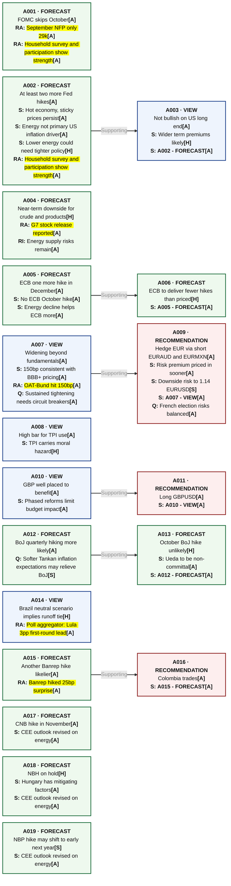

```mermaid
%%{init: {"flowchart": {"htmlLabels": true, "nodeSpacing": 20, "rankSpacing": 60}, "themeCSS": ".arg{width:330px;text-align:left;color:#111111} .core,.c{display:flex;justify-content:space-between;align-items:flex-end;gap:8px;margin-top:4px;padding:3px 6px;color:#111111} .core{border:2px solid} .c{border:1.5px solid;border-radius:10px} .rec{background:#f8c9c9;border-color:#8b1a1a} .val{background:#e3d4f5;border-color:#5b2c8f} .fc{background:#c9ecc9;border-color:#1a6b3a} .view{background:#c9dcf8;border-color:#1a3f8b} .dp{background:#d4d4d4;border-color:#5f5f5f} .obs{background:#e6e6e6;border-color:#888888} mark{background:#e6e6e6;color:#111111;padding:0 2px} .edgeLabel,.edgeLabel *{color:#9a9a9a !important;fill:#9a9a9a !important}"}}%%
flowchart LR
    A001["<div class='arg'><b>A001 · FORECAST</b><div class='core fc'><span>FOMC skips October</span><b>[A]</b></div><div class='c dp'><span><b>RA:</b> <mark>September NFP only 29k</mark></span><b>[A]</b></div><div class='c dp'><span><b>RA:</b> <mark>Household survey and participation show strength</mark></span><b>[A]</b></div></div>"]
    A002["<div class='arg'><b>A002 · FORECAST</b><div class='core fc'><span>At least two more Fed hikes</span><b>[A]</b></div><div class='c view'><span><b>S:</b> Hot economy, sticky prices persist</span><b>[A]</b></div><div class='c view'><span><b>S:</b> Energy not primary US inflation driver</span><b>[A]</b></div><div class='c view'><span><b>S:</b> Lower energy could need tighter policy</span><b>[H]</b></div><div class='c dp'><span><b>RA:</b> <mark>Household survey and participation show strength</mark></span><b>[A]</b></div></div>"]
    A003["<div class='arg'><b>A003 · VIEW</b><div class='core view'><span>Not bullish on US long end</span><b>[A]</b></div><div class='c fc'><span><b>S:</b> Wider term premiums likely</span><b>[H]</b></div><div class='c fc'><span><b>S:</b> <b>A002 - FORECAST</b></span><b>[A]</b></div></div>"]
    A004["<div class='arg'><b>A004 · FORECAST</b><div class='core fc'><span>Near-term downside for crude and products</span><b>[H]</b></div><div class='c dp'><span><b>RA:</b> <mark>G7 stock release reported</mark></span><b>[A]</b></div><div class='c view'><span><b>RI:</b> Energy supply risks remain</span><b>[A]</b></div></div>"]
    A005["<div class='arg'><b>A005 · FORECAST</b><div class='core fc'><span>ECB one more hike in December</span><b>[A]</b></div><div class='c fc'><span><b>S:</b> No ECB October hike</span><b>[A]</b></div><div class='c view'><span><b>S:</b> Energy decline helps ECB more</span><b>[A]</b></div></div>"]
    A006["<div class='arg'><b>A006 · FORECAST</b><div class='core fc'><span>ECB to deliver fewer hikes than priced</span><b>[H]</b></div><div class='c fc'><span><b>S:</b> <b>A005 - FORECAST</b></span><b>[A]</b></div></div>"]
    A007["<div class='arg'><b>A007 · VIEW</b><div class='core view'><span>Widening beyond fundamentals</span><b>[A]</b></div><div class='c val'><span><b>S:</b> 150bp consistent with BBB+ pricing</span><b>[A]</b></div><div class='c dp'><span><b>RA:</b> <mark>OAT-Bund hit 150bp</mark></span><b>[A]</b></div><div class='c view'><span><b>Q:</b> Sustained tightening needs circuit breakers</span><b>[A]</b></div></div>"]
    A008["<div class='arg'><b>A008 · VIEW</b><div class='core view'><span>High bar for TPI use</span><b>[A]</b></div><div class='c view'><span><b>S:</b> TPI carries moral hazard</span><b>[H]</b></div></div>"]
    A009["<div class='arg'><b>A009 · RECOMMENDATION</b><div class='core rec'><span>Hedge EUR via short EURAUD and EURMXN</span><b>[A]</b></div><div class='c view'><span><b>S:</b> Risk premium priced in sooner</span><b>[A]</b></div><div class='c fc'><span><b>S:</b> Downside risk to 1.14 EURUSD</span><b>[S]</b></div><div class='c view'><span><b>S:</b> <b>A007 - VIEW</b></span><b>[A]</b></div><div class='c view'><span><b>Q:</b> French election risks balanced</span><b>[A]</b></div></div>"]
    A010["<div class='arg'><b>A010 · VIEW</b><div class='core view'><span>GBP well placed to benefit</span><b>[A]</b></div><div class='c view'><span><b>S:</b> Phased reforms limit budget impact</span><b>[A]</b></div></div>"]
    A011["<div class='arg'><b>A011 · RECOMMENDATION</b><div class='core rec'><span>Long GBPUSD</span><b>[A]</b></div><div class='c view'><span><b>S:</b> <b>A010 - VIEW</b></span><b>[A]</b></div></div>"]
    A012["<div class='arg'><b>A012 · FORECAST</b><div class='core fc'><span>BoJ quarterly hiking more likely</span><b>[A]</b></div><div class='c view'><span><b>Q:</b> Softer Tankan inflation expectations may relieve BoJ</span><b>[S]</b></div></div>"]
    A013["<div class='arg'><b>A013 · FORECAST</b><div class='core fc'><span>October BoJ hike unlikely</span><b>[H]</b></div><div class='c fc'><span><b>S:</b> Ueda to be non-committal</span><b>[A]</b></div><div class='c fc'><span><b>S:</b> <b>A012 - FORECAST</b></span><b>[A]</b></div></div>"]
    A014["<div class='arg'><b>A014 · VIEW</b><div class='core view'><span>Brazil neutral scenario implies runoff tie</span><b>[H]</b></div><div class='c dp'><span><b>RA:</b> <mark>Poll aggregator: Lula 3pp first-round lead</mark></span><b>[A]</b></div></div>"]
    A015["<div class='arg'><b>A015 · FORECAST</b><div class='core fc'><span>Another Banrep hike likelier</span><b>[A]</b></div><div class='c dp'><span><b>RA:</b> <mark>Banrep hiked 25bp surprise</mark></span><b>[A]</b></div></div>"]
    A016["<div class='arg'><b>A016 · RECOMMENDATION</b><div class='core rec'><span>Colombia trades</span><b>[A]</b></div><div class='c fc'><span><b>S:</b> <b>A015 - FORECAST</b></span><b>[A]</b></div></div>"]
    A017["<div class='arg'><b>A017 · FORECAST</b><div class='core fc'><span>CNB hike in November</span><b>[A]</b></div><div class='c view'><span><b>S:</b> CEE outlook revised on energy</span><b>[A]</b></div></div>"]
    A018["<div class='arg'><b>A018 · FORECAST</b><div class='core fc'><span>NBH on hold</span><b>[H]</b></div><div class='c view'><span><b>S:</b> Hungary has mitigating factors</span><b>[A]</b></div><div class='c view'><span><b>S:</b> CEE outlook revised on energy</span><b>[A]</b></div></div>"]
    A019["<div class='arg'><b>A019 · FORECAST</b><div class='core fc'><span>NBP hike may shift to early next year</span><b>[S]</b></div><div class='c view'><span><b>S:</b> CEE outlook revised on energy</span><b>[A]</b></div></div>"]

    A002 -- Supporting --> A003
    A005 -- Supporting --> A006
    A007 -- Supporting --> A009
    A010 -- Supporting --> A011
    A012 -- Supporting --> A013
    A015 -- Supporting --> A016

    classDef fc fill:#eef9ee,stroke:#1a6b3a,stroke-width:2px,color:#111111
    classDef rec fill:#fdeeee,stroke:#8b1a1a,stroke-width:2px,color:#111111
    classDef view fill:#eef4fd,stroke:#1a3f8b,stroke-width:2px,color:#111111
    class A001,A002,A004,A005,A006,A012,A013,A015,A017,A018,A019 fc
    class A009,A011,A016 rec
    class A003,A007,A008,A010,A014 view
    linkStyle default stroke:#333333,stroke-width:2px,color:#9a9a9a
```
