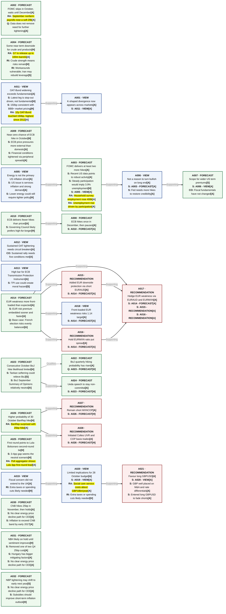

```mermaid
%%{init: {"flowchart": {"htmlLabels": true, "nodeSpacing": 20, "rankSpacing": 60}, "themeCSS": ".arg{width:330px;text-align:left;color:#111111} .core,.c{display:flex;justify-content:space-between;align-items:flex-end;gap:8px;margin-top:4px;padding:3px 6px;color:#111111} .core{border:2px solid} .c{border:1.5px solid;border-radius:10px} .rec{background:#f8c9c9;border-color:#8b1a1a} .val{background:#e3d4f5;border-color:#5b2c8f} .fc{background:#c9ecc9;border-color:#1a6b3a} .view{background:#c9dcf8;border-color:#1a3f8b} .dp{background:#d4d4d4;border-color:#5f5f5f} .obs{background:#e6e6e6;border-color:#888888} mark{background:#e6e6e6;color:#111111;padding:0 2px} .edgeLabel,.edgeLabel *{color:#9a9a9a !important;fill:#9a9a9a !important}"}}%%
flowchart LR
    A001["<div class='arg'><b>A001 · VIEW</b><div class='core view'><span>K-shaped divergence now appears across markets</span><b>[A]</b></div><div class='c view'><span><b>S:</b> <b>A011 - VIEW</b></span><b>[A]</b></div></div>"]
    A002["<div class='arg'><b>A002 · FORECAST</b><div class='core fc'><span>FOMC skips in October, waits until December</span><b>[A]</b></div><div class='c dp'><span><b>RA:</b> <mark>September nonfarm payrolls rose a soft 29k</mark></span><b>[A]</b></div><div class='c view'><span><b>Q:</b> Data does not remove need for further tightening</span><b>[A]</b></div></div>"]
    A003["<div class='arg'><b>A003 · FORECAST</b><div class='core fc'><span>FOMC delivers at least two more hikes</span><b>[A]</b></div><div class='c view'><span><b>S:</b> Recent US data points to robust activity</span><b>[A]</b></div><div class='c fc'><span><b>S:</b> Steady participation would imply 3.9% unemployment</span><b>[H]</b></div><div class='c view'><span><b>S:</b> <b>A005 - VIEW</b></span><b>[A]</b></div><div class='c dp'><span><b>RA:</b> <mark>Household survey employment rose 406k</mark></span><b>[A]</b></div><div class='c dp'><span><b>RA:</b> <mark>Unemployment rise driven by participation</mark></span><b>[A]</b></div></div>"]
    A004["<div class='arg'><b>A004 · FORECAST</b><div class='core fc'><span>Some near-term downside for crude and products</span><b>[H]</b></div><div class='c dp'><span><b>RA:</b> <mark>G7 to release up to 100m barrels</mark></span><b>[A]</b></div><div class='c view'><span><b>RI:</b> Crude strength means risks remain</span><b>[H]</b></div><div class='c view'><span><b>RI:</b> Workarounds vulnerable; Iran may rebuild leverage</span><b>[S]</b></div></div>"]
    A005["<div class='arg'><b>A005 · VIEW</b><div class='core view'><span>Energy is not the primary US inflation driver</span><b>[A]</b></div><div class='c view'><span><b>S:</b> US issue is services inflation and strong demand</span><b>[A]</b></div><div class='c view'><span><b>S:</b> Lower energy could still require tighter policy</span><b>[H]</b></div></div>"]
    A006["<div class='arg'><b>A006 · VIEW</b><div class='core view'><span>Not a reason to turn bullish on long end</span><b>[A]</b></div><div class='c fc'><span><b>S:</b> <b>A003 - FORECAST</b></span><b>[A]</b></div><div class='c view'><span><b>S:</b> Fed needs more hikes to restore credibility</span><b>[A]</b></div></div>"]
    A007["<div class='arg'><b>A007 · FORECAST</b><div class='core fc'><span>Scope for wider US term premiums</span><b>[S]</b></div><div class='c view'><span><b>S:</b> <b>A006 - VIEW</b></span><b>[A]</b></div><div class='c view'><span><b>CO:</b> Fiscal fundamentals have not changed</span><b>[A]</b></div></div>"]
    A008["<div class='arg'><b>A008 · FORECAST</b><div class='core fc'><span>ECB hikes once in December, then pauses</span><b>[A]</b></div><div class='c fc'><span><b>S:</b> <b>A010 - FORECAST</b></span><b>[A]</b></div></div>"]
    A009["<div class='arg'><b>A009 · FORECAST</b><div class='core fc'><span>Near-zero chance of ECB hike in October</span><b>[H]</b></div><div class='c view'><span><b>S:</b> ECB price pressures more external than domestic</span><b>[A]</b></div><div class='c view'><span><b>S:</b> Financial conditions tightened via peripheral spreads</span><b>[A]</b></div></div>"]
    A010["<div class='arg'><b>A010 · FORECAST</b><div class='core fc'><span>ECB delivers fewer hikes than priced</span><b>[A]</b></div><div class='c view'><span><b>S:</b> Governing Council likely prefers high-for-longer</span><b>[H]</b></div></div>"]
    A011["<div class='arg'><b>A011 · VIEW</b><div class='core view'><span>OAT-Bund widening exceeds fundamentals</span><b>[A]</b></div><div class='c view'><span><b>S:</b> Latest leg is stop-out driven, not fundamental</span><b>[H]</b></div><div class='c val'><span><b>S:</b> 150bp consistent with BBB+ market pricing</span><b>[H]</b></div><div class='c dp'><span><b>RA:</b> <mark>10y OAT-Bund touched 150bp, highest since 2012</mark></span><b>[A]</b></div></div>"]
    A012["<div class='arg'><b>A012 · VIEW</b><div class='core view'><span>Sustained OAT tightening needs circuit breakers</span><b>[A]</b></div><div class='c view'><span><b>CO:</b> Sustained rally needs five conditions met</span><b>[A]</b></div></div>"]
    A013["<div class='arg'><b>A013 · VIEW</b><div class='core view'><span>High bar for ECB Transmission Protection Instrument</span><b>[A]</b></div><div class='c view'><span><b>S:</b> TPI use could create moral hazard</span><b>[S]</b></div></div>"]
    A014["<div class='arg'><b>A014 · FORECAST</b><div class='core fc'><span>EUR weakness more front-loaded than expected</span><b>[A]</b></div><div class='c view'><span><b>S:</b> EUR risk premium embedded sooner and faster</span><b>[A]</b></div><div class='c view'><span><b>Q:</b> Base case: French election risks evenly balanced</span><b>[A]</b></div></div>"]
    A015["<div class='arg'><b>A015 · RECOMMENDATION</b><div class='core rec'><span>Added EUR downside protection via short EURAUD</span><b>[A]</b></div><div class='c fc'><span><b>S:</b> <b>A014 - FORECAST</b></span><b>[A]</b></div></div>"]
    A016["<div class='arg'><b>A016 · RECOMMENDATION</b><div class='core rec'><span>Hold EURMXN ratio put spread</span><b>[A]</b></div><div class='c fc'><span><b>S:</b> <b>A014 - FORECAST</b></span><b>[A]</b></div></div>"]
    A017["<div class='arg'><b>A017 · RECOMMENDATION</b><div class='core rec'><span>Hedge EUR weakness via EURAUD and EURMXN</span><b>[A]</b></div><div class='c fc'><span><b>S:</b> <b>A014 - FORECAST</b></span><b>[A]</b></div><div class='c rec'><span><b>S:</b> <b>A015 - RECOMMENDATION</b></span><b>[A]</b></div><div class='c rec'><span><b>S:</b> <b>A016 - RECOMMENDATION</b></span><b>[A]</b></div></div>"]
    A018["<div class='arg'><b>A018 · VIEW</b><div class='core view'><span>Front-loaded EUR weakness risks 1.14 target</span><b>[A]</b></div><div class='c fc'><span><b>S:</b> <b>A014 - FORECAST</b></span><b>[A]</b></div></div>"]
    A019["<div class='arg'><b>A019 · VIEW</b><div class='core view'><span>Fiscal concern did not extend to the UK</span><b>[A]</b></div><div class='c view'><span><b>RI:</b> Extra taxes or spending cuts likely needed</span><b>[H]</b></div></div>"]
    A020["<div class='arg'><b>A020 · VIEW</b><div class='core view'><span>Limited implications for 28 October budget</span><b>[A]</b></div><div class='c view'><span><b>S:</b> <b>A019 - VIEW</b></span><b>[A]</b></div><div class='c dp'><span><b>RA:</b> <mark>Social care service costs about GBP18bn/year</mark></span><b>[A]</b></div><div class='c view'><span><b>RI:</b> Extra taxes or spending cuts likely needed</span><b>[H]</b></div></div>"]
    A021["<div class='arg'><b>A021 · RECOMMENDATION</b><div class='core rec'><span>Favour long GBPUSD</span><b>[A]</b></div><div class='c view'><span><b>S:</b> <b>A020 - VIEW</b></span><b>[A]</b></div><div class='c view'><span><b>S:</b> GBP well placed on M&amp;A and rate differentials</span><b>[A]</b></div><div class='c rec'><span><b>S:</b> Entered long GBPUSD to fade shorts</span><b>[A]</b></div></div>"]
    A022["<div class='arg'><b>A022 · FORECAST</b><div class='core fc'><span>BoJ quarterly hiking probability has risen</span><b>[A]</b></div><div class='c fc'><span><b>Q:</b> <b>A023 - FORECAST</b></span><b>[H]</b></div></div>"]
    A023["<div class='arg'><b>A023 · FORECAST</b><div class='core fc'><span>Consecutive October BoJ hike likelihood limited</span><b>[H]</b></div><div class='c view'><span><b>S:</b> Tankan softening could relieve BoJ</span><b>[S]</b></div><div class='c view'><span><b>S:</b> BoJ September Summary of Opinions relatively neutral</span><b>[A]</b></div></div>"]
    A024["<div class='arg'><b>A024 · FORECAST</b><div class='core fc'><span>Ueda speech to stay non-committal</span><b>[A]</b></div><div class='c fc'><span><b>S:</b> <b>A023 - FORECAST</b></span><b>[H]</b></div></div>"]
    A025["<div class='arg'><b>A025 · FORECAST</b><div class='core fc'><span>First round points to Lula-Bolsonaro second-round tie</span><b>[H]</b></div><div class='c view'><span><b>S:</b> 3-4pp gap seems the neutral scenario</span><b>[H]</b></div><div class='c dp'><span><b>RA:</b> <mark>Poll aggregator shows Lula 3pp first-round lead</mark></span><b>[A]</b></div></div>"]
    A026["<div class='arg'><b>A026 · FORECAST</b><div class='core fc'><span>Higher probability of 30 October BanRep hike</span><b>[H]</b></div><div class='c dp'><span><b>RA:</b> <mark>BanRep surprised with 25bp hike</mark></span><b>[A]</b></div></div>"]
    A027["<div class='arg'><b>A027 · RECOMMENDATION</b><div class='core rec'><span>Remain short MXNCOP</span><b>[A]</b></div><div class='c fc'><span><b>S:</b> <b>A026 - FORECAST</b></span><b>[H]</b></div></div>"]
    A028["<div class='arg'><b>A028 · RECOMMENDATION</b><div class='core rec'><span>Initiated Coltes UVR and COP basis trades</span><b>[A]</b></div><div class='c fc'><span><b>S:</b> <b>A026 - FORECAST</b></span><b>[H]</b></div></div>"]
    A030["<div class='arg'><b>A030 · FORECAST</b><div class='core fc'><span>CNB hikes 25bp in November, then holds</span><b>[A]</b></div><div class='c view'><span><b>S:</b> No clear energy price decline path for CEE</span><b>[A]</b></div><div class='c fc'><span><b>S:</b> Inflation to exceed CNB band by early 2027</span><b>[A]</b></div></div>"]
    A031["<div class='arg'><b>A031 · FORECAST</b><div class='core fc'><span>NBH likely on hold until sentiment improves</span><b>[H]</b></div><div class='c fc'><span><b>S:</b> Removed one of two Q4 25bp cuts</span><b>[A]</b></div><div class='c view'><span><b>S:</b> Hungary has bigger mitigating factors</span><b>[A]</b></div><div class='c view'><span><b>S:</b> No clear energy price decline path for CEE</span><b>[A]</b></div></div>"]
    A032["<div class='arg'><b>A032 · FORECAST</b><div class='core fc'><span>NBP tightening may shift to early next year</span><b>[S]</b></div><div class='c view'><span><b>S:</b> No clear energy price decline path for CEE</span><b>[A]</b></div><div class='c view'><span><b>S:</b> Subsidies should improve short-term inflation outlook</span><b>[H]</b></div></div>"]

    A011 -- Supporting --> A001
    A005 -- Supporting --> A003
    A003 -- Supporting --> A006
    A006 -- Supporting --> A007
    A010 -- Supporting --> A008
    A014 -- Supporting --> A015
    A014 -- Supporting --> A016
    A014 -- Supporting --> A017
    A015 -- Supporting --> A017
    A016 -- Supporting --> A017
    A014 -- Supporting --> A018
    A019 -- Supporting --> A020
    A020 -- Supporting --> A021
    A023 -. Qualifies .-> A022
    A023 -- Supporting --> A024
    A026 -- Supporting --> A027
    A026 -- Supporting --> A028

    classDef fc fill:#eef9ee,stroke:#1a6b3a,stroke-width:2px,color:#111111
    classDef rec fill:#fdeeee,stroke:#8b1a1a,stroke-width:2px,color:#111111
    classDef view fill:#eef4fd,stroke:#1a3f8b,stroke-width:2px,color:#111111
    class A002,A003,A004,A007,A008,A009,A010,A014,A022,A023,A024,A025,A026,A030,A031,A032 fc
    class A015,A016,A017,A021,A027,A028 rec
    class A001,A005,A006,A011,A012,A013,A018,A019,A020 view
    linkStyle default stroke:#333333,stroke-width:2px,color:#9a9a9a
```
