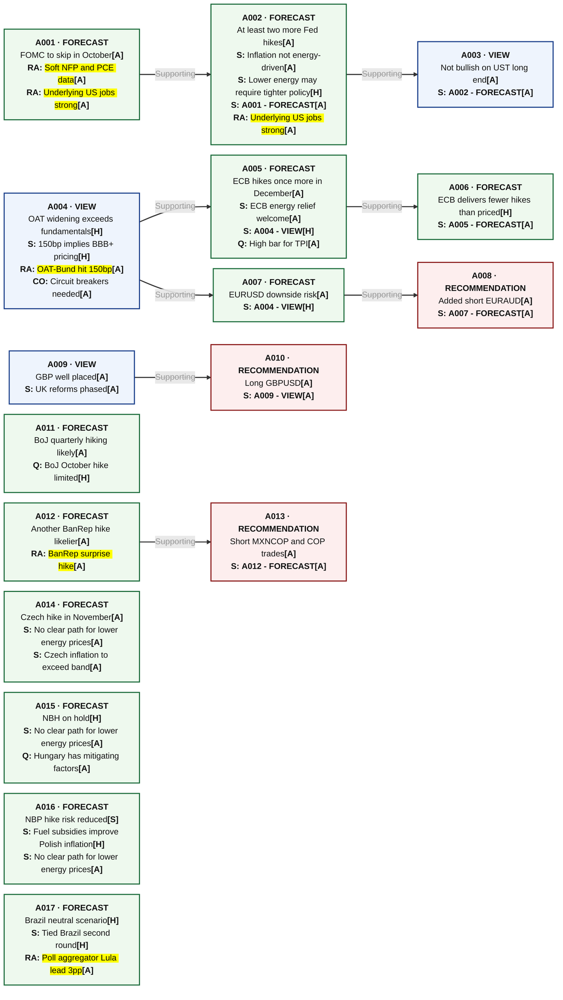

```mermaid
%%{init: {"flowchart": {"htmlLabels": true, "nodeSpacing": 20, "rankSpacing": 60}, "themeCSS": ".arg{width:330px;text-align:left;color:#111111} .core,.c{display:flex;justify-content:space-between;align-items:flex-end;gap:8px;margin-top:4px;padding:3px 6px;color:#111111} .core{border:2px solid} .c{border:1.5px solid;border-radius:10px} .rec{background:#f8c9c9;border-color:#8b1a1a} .val{background:#e3d4f5;border-color:#5b2c8f} .fc{background:#c9ecc9;border-color:#1a6b3a} .view{background:#c9dcf8;border-color:#1a3f8b} .dp{background:#d4d4d4;border-color:#5f5f5f} .obs{background:#e6e6e6;border-color:#888888} mark{background:#e6e6e6;color:#111111;padding:0 2px} .edgeLabel,.edgeLabel *{color:#9a9a9a !important;fill:#9a9a9a !important}"}}%%
flowchart LR
    A001["<div class='arg'><b>A001 · FORECAST</b><div class='core fc'><span>FOMC to skip in October</span><b>[A]</b></div><div class='c dp'><span><b>RA:</b> <mark>Soft NFP and PCE data</mark></span><b>[A]</b></div><div class='c dp'><span><b>RA:</b> <mark>Underlying US jobs strong</mark></span><b>[A]</b></div></div>"]
    A002["<div class='arg'><b>A002 · FORECAST</b><div class='core fc'><span>At least two more Fed hikes</span><b>[A]</b></div><div class='c view'><span><b>S:</b> Inflation not energy-driven</span><b>[A]</b></div><div class='c view'><span><b>S:</b> Lower energy may require tighter policy</span><b>[H]</b></div><div class='c fc'><span><b>S:</b> <b>A001 - FORECAST</b></span><b>[A]</b></div><div class='c dp'><span><b>RA:</b> <mark>Underlying US jobs strong</mark></span><b>[A]</b></div></div>"]
    A003["<div class='arg'><b>A003 · VIEW</b><div class='core view'><span>Not bullish on UST long end</span><b>[A]</b></div><div class='c fc'><span><b>S:</b> <b>A002 - FORECAST</b></span><b>[A]</b></div></div>"]
    A004["<div class='arg'><b>A004 · VIEW</b><div class='core view'><span>OAT widening exceeds fundamentals</span><b>[H]</b></div><div class='c val'><span><b>S:</b> 150bp implies BBB+ pricing</span><b>[H]</b></div><div class='c dp'><span><b>RA:</b> <mark>OAT-Bund hit 150bp</mark></span><b>[A]</b></div><div class='c view'><span><b>CO:</b> Circuit breakers needed</span><b>[A]</b></div></div>"]
    A005["<div class='arg'><b>A005 · FORECAST</b><div class='core fc'><span>ECB hikes once more in December</span><b>[A]</b></div><div class='c view'><span><b>S:</b> ECB energy relief welcome</span><b>[A]</b></div><div class='c view'><span><b>S:</b> <b>A004 - VIEW</b></span><b>[H]</b></div><div class='c view'><span><b>Q:</b> High bar for TPI</span><b>[A]</b></div></div>"]
    A006["<div class='arg'><b>A006 · FORECAST</b><div class='core fc'><span>ECB delivers fewer hikes than priced</span><b>[H]</b></div><div class='c fc'><span><b>S:</b> <b>A005 - FORECAST</b></span><b>[A]</b></div></div>"]
    A007["<div class='arg'><b>A007 · FORECAST</b><div class='core fc'><span>EURUSD downside risk</span><b>[A]</b></div><div class='c view'><span><b>S:</b> <b>A004 - VIEW</b></span><b>[H]</b></div></div>"]
    A008["<div class='arg'><b>A008 · RECOMMENDATION</b><div class='core rec'><span>Added short EURAUD</span><b>[A]</b></div><div class='c fc'><span><b>S:</b> <b>A007 - FORECAST</b></span><b>[A]</b></div></div>"]
    A009["<div class='arg'><b>A009 · VIEW</b><div class='core view'><span>GBP well placed</span><b>[A]</b></div><div class='c view'><span><b>S:</b> UK reforms phased</span><b>[A]</b></div></div>"]
    A010["<div class='arg'><b>A010 · RECOMMENDATION</b><div class='core rec'><span>Long GBPUSD</span><b>[A]</b></div><div class='c view'><span><b>S:</b> <b>A009 - VIEW</b></span><b>[A]</b></div></div>"]
    A011["<div class='arg'><b>A011 · FORECAST</b><div class='core fc'><span>BoJ quarterly hiking likely</span><b>[A]</b></div><div class='c fc'><span><b>Q:</b> BoJ October hike limited</span><b>[H]</b></div></div>"]
    A012["<div class='arg'><b>A012 · FORECAST</b><div class='core fc'><span>Another BanRep hike likelier</span><b>[A]</b></div><div class='c dp'><span><b>RA:</b> <mark>BanRep surprise hike</mark></span><b>[A]</b></div></div>"]
    A013["<div class='arg'><b>A013 · RECOMMENDATION</b><div class='core rec'><span>Short MXNCOP and COP trades</span><b>[A]</b></div><div class='c fc'><span><b>S:</b> <b>A012 - FORECAST</b></span><b>[A]</b></div></div>"]
    A014["<div class='arg'><b>A014 · FORECAST</b><div class='core fc'><span>Czech hike in November</span><b>[A]</b></div><div class='c view'><span><b>S:</b> No clear path for lower energy prices</span><b>[A]</b></div><div class='c fc'><span><b>S:</b> Czech inflation to exceed band</span><b>[A]</b></div></div>"]
    A015["<div class='arg'><b>A015 · FORECAST</b><div class='core fc'><span>NBH on hold</span><b>[H]</b></div><div class='c view'><span><b>S:</b> No clear path for lower energy prices</span><b>[A]</b></div><div class='c view'><span><b>Q:</b> Hungary has mitigating factors</span><b>[A]</b></div></div>"]
    A016["<div class='arg'><b>A016 · FORECAST</b><div class='core fc'><span>NBP hike risk reduced</span><b>[S]</b></div><div class='c view'><span><b>S:</b> Fuel subsidies improve Polish inflation</span><b>[H]</b></div><div class='c view'><span><b>S:</b> No clear path for lower energy prices</span><b>[A]</b></div></div>"]
    A017["<div class='arg'><b>A017 · FORECAST</b><div class='core fc'><span>Brazil neutral scenario</span><b>[H]</b></div><div class='c fc'><span><b>S:</b> Tied Brazil second round</span><b>[H]</b></div><div class='c dp'><span><b>RA:</b> <mark>Poll aggregator Lula lead 3pp</mark></span><b>[A]</b></div></div>"]

    A001 -- Supporting --> A002
    A002 -- Supporting --> A003
    A004 -- Supporting --> A005
    A005 -- Supporting --> A006
    A004 -- Supporting --> A007
    A007 -- Supporting --> A008
    A009 -- Supporting --> A010
    A012 -- Supporting --> A013

    classDef fc fill:#eef9ee,stroke:#1a6b3a,stroke-width:2px,color:#111111
    classDef rec fill:#fdeeee,stroke:#8b1a1a,stroke-width:2px,color:#111111
    classDef view fill:#eef4fd,stroke:#1a3f8b,stroke-width:2px,color:#111111
    class A001,A002,A005,A006,A007,A011,A012,A014,A015,A016,A017 fc
    class A008,A010,A013 rec
    class A003,A004,A009 view
    linkStyle default stroke:#333333,stroke-width:2px,color:#9a9a9a
```
