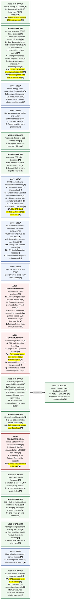

```mermaid
%%{init: {"flowchart": {"htmlLabels": true, "nodeSpacing": 20, "rankSpacing": 60}, "themeCSS": ".arg{width:330px;text-align:left;color:#111111} .core,.c{display:flex;justify-content:space-between;align-items:flex-end;gap:8px;margin-top:4px;padding:3px 6px;color:#111111} .core{border:2px solid} .c{border:1.5px solid;border-radius:10px} .rec{background:#f8c9c9;border-color:#8b1a1a} .val{background:#e3d4f5;border-color:#5b2c8f} .fc{background:#c9ecc9;border-color:#1a6b3a} .view{background:#c9dcf8;border-color:#1a3f8b} .dp{background:#d4d4d4;border-color:#5f5f5f} .obs{background:#e6e6e6;border-color:#888888} mark{background:#e6e6e6;color:#111111;padding:0 2px} .edgeLabel,.edgeLabel *{color:#9a9a9a !important;fill:#9a9a9a !important}"}}%%
flowchart LR
    A001["<div class='arg'><b>A001 · FORECAST</b><div class='core fc'><span>FOMC to skip in October</span><b>[A]</b></div><div class='c view'><span><b>S:</b> Soft payrolls and PCE likely ease FOMC pressure</span><b>[H]</b></div><div class='c dp'><span><b>RA:</b> <mark>Nonfarm payrolls rose 29k in September</mark></span><b>[A]</b></div></div>"]
    A002["<div class='arg'><b>A002 · FORECAST</b><div class='core fc'><span>At least two more FOMC hikes expected</span><b>[A]</b></div><div class='c view'><span><b>S:</b> Recent data points to robust US activity</span><b>[A]</b></div><div class='c view'><span><b>S:</b> Data does not change hot-economy narrative</span><b>[A]</b></div><div class='c view'><span><b>S:</b> Headline NFP understated underlying strength</span><b>[A]</b></div><div class='c view'><span><b>S:</b> Unemployment rise driven by participation</span><b>[A]</b></div><div class='c fc'><span><b>S:</b> Steady participation implies 3.9% unemployment</span><b>[S]</b></div><div class='c dp'><span><b>RA:</b> <mark>Household survey employment rose 406k</mark></span><b>[A]</b></div><div class='c dp'><span><b>RA:</b> <mark>Unemployment rate rose 4.1% to 4.2%</mark></span><b>[A]</b></div></div>"]
    A003["<div class='arg'><b>A003 · VIEW</b><div class='core view'><span>Lower energy could necessitate tighter policy</span><b>[S]</b></div><div class='c view'><span><b>S:</b> Energy not the primary US pressure driver</span><b>[A]</b></div><div class='c view'><span><b>S:</b> US issue is services inflation and demand</span><b>[A]</b></div></div>"]
    A004["<div class='arg'><b>A004 · VIEW</b><div class='core view'><span>Not a reason to turn bullish long end</span><b>[A]</b></div><div class='c view'><span><b>S:</b> Market needs to see further Fed hikes</span><b>[A]</b></div><div class='c view'><span><b>S:</b> Scope for wider term premiums</span><b>[H]</b></div></div>"]
    A005["<div class='arg'><b>A005 · FORECAST</b><div class='core fc'><span>Near-zero chance of ECB October hike</span><b>[H]</b></div><div class='c view'><span><b>S:</b> ECB price pressures externally driven</span><b>[A]</b></div></div>"]
    A006["<div class='arg'><b>A006 · FORECAST</b><div class='core fc'><span>One more ECB hike in December</span><b>[A]</b></div><div class='c fc'><span><b>S:</b> ECB to deliver fewer hikes than priced</span><b>[A]</b></div><div class='c view'><span><b>S:</b> Council likely prefers high-for-longer</span><b>[H]</b></div></div>"]
    A007["<div class='arg'><b>A007 · VIEW</b><div class='core view'><span>OAT-Bund widening exceeds fundamentals</span><b>[A]</b></div><div class='c view'><span><b>S:</b> Latest leg is stop-out-driven selling</span><b>[H]</b></div><div class='c view'><span><b>S:</b> Fundamentals weak but not suddenly worse</span><b>[A]</b></div><div class='c val'><span><b>S:</b> 150bp consistent with pricing towards BBB+</span><b>[H]</b></div><div class='c view'><span><b>S:</b> OATs sold on debt-sustainability concerns</span><b>[A]</b></div><div class='c dp'><span><b>RA:</b> <mark>10y OAT-Bund touched 150bp, highest since 2012</mark></span><b>[A]</b></div></div>"]
    A008["<div class='arg'><b>A008 · VIEW</b><div class='core view'><span>Several circuit breakers needed for sustained tightening</span><b>[H]</b></div><div class='c view'><span><b>CO:</b> Positioning must be cleared out</span><b>[H]</b></div><div class='c view'><span><b>CO:</b> French budget must pass this year</span><b>[H]</b></div><div class='c view'><span><b>CO:</b> Strong OAT auctions needed</span><b>[H]</b></div><div class='c view'><span><b>CO:</b> RN fiscal plan details needed</span><b>[H]</b></div><div class='c view'><span><b>CO:</b> Shift in French opinion polls needed</span><b>[H]</b></div></div>"]
    A009["<div class='arg'><b>A009 · VIEW</b><div class='core view'><span>High bar for ECB to use TPI</span><b>[A]</b></div><div class='c view'><span><b>S:</b> Intervention could carry moral hazard</span><b>[S]</b></div></div>"]
    A010["<div class='arg'><b>A010 · RECOMMENDATION</b><div class='core rec'><span>Hedge further EUR weakness</span><b>[A]</b></div><div class='c rec'><span><b>S:</b> Added EUR protection via short EURAUD</span><b>[A]</b></div><div class='c view'><span><b>S:</b> Forecasts captured premium before French vote</span><b>[A]</b></div><div class='c view'><span><b>S:</b> Premium embedded sooner than expected</span><b>[A]</b></div><div class='c view'><span><b>S:</b> Front-loaded EUR weakness is target downside risk</span><b>[A]</b></div><div class='c view'><span><b>Q:</b> French election risks evenly balanced</span><b>[A]</b></div></div>"]
    A011["<div class='arg'><b>A011 · RECOMMENDATION</b><div class='core rec'><span>Favour long GBPUSD</span><b>[A]</b></div><div class='c view'><span><b>S:</b> GBP well placed to benefit</span><b>[A]</b></div><div class='c rec'><span><b>S:</b> Long GBPUSD position entered</span><b>[A]</b></div><div class='c dp'><span><b>RA:</b> <mark>Fully funded social care service about GBP18bn/year</mark></span><b>[A]</b></div><div class='c view'><span><b>RI:</b> More tax hikes or cuts likely needed</span><b>[H]</b></div><div class='c view'><span><b>Q:</b> Reforms have limited budget implications</span><b>[A]</b></div></div>"]
    A012["<div class='arg'><b>A012 · FORECAST</b><div class='core fc'><span>BoJ likely to pursue quarterly hiking cycle</span><b>[A]</b></div><div class='c view'><span><b>S:</b> Corporate resilience underpinned by AI boom</span><b>[A]</b></div><div class='c view'><span><b>S:</b> Tokyo CPI confirmed energy, chip and wage spillovers</span><b>[A]</b></div><div class='c view'><span><b>RI:</b> Softer inflation expectations could ease BoJ</span><b>[S]</b></div></div>"]
    A013["<div class='arg'><b>A013 · FORECAST</b><div class='core fc'><span>Consecutive BoJ hike in October limited</span><b>[H]</b></div><div class='c fc'><span><b>S:</b> <b>A012 - FORECAST</b></span><b>[A]</b></div><div class='c fc'><span><b>S:</b> Ueda speech to remain non-committal</span><b>[A]</b></div></div>"]
    A014["<div class='arg'><b>A014 · FORECAST</b><div class='core fc'><span>Second round likely a tie</span><b>[H]</b></div><div class='c view'><span><b>S:</b> 3-4pp gap seems the neutral scenario</span><b>[H]</b></div><div class='c dp'><span><b>RA:</b> <mark>Poll aggregator shows Lula 3pp ahead</mark></span><b>[A]</b></div></div>"]
    A015["<div class='arg'><b>A015 · RECOMMENDATION</b><div class='core rec'><span>Initiate Coltes UVR and COP basis trades</span><b>[A]</b></div><div class='c view'><span><b>S:</b> Hawkish BanRep reinforced short MXNCOP conviction</span><b>[A]</b></div><div class='c fc'><span><b>S:</b> Probability of 30 October Banrep hike rises</span><b>[H]</b></div><div class='c dp'><span><b>RA:</b> <mark>Banrep surprised with 25bp hike</mark></span><b>[A]</b></div></div>"]
    A016["<div class='arg'><b>A016 · FORECAST</b><div class='core fc'><span>25bp Czech hike in November</span><b>[A]</b></div><div class='c fc'><span><b>S:</b> Inflation to exceed CNB band by early 2027</span><b>[A]</b></div><div class='c view'><span><b>S:</b> No clear path to energy price decline</span><b>[A]</b></div></div>"]
    A017["<div class='arg'><b>A017 · FORECAST</b><div class='core fc'><span>NBH likely on hold until risk sentiment improves</span><b>[H]</b></div><div class='c view'><span><b>S:</b> Hungary has bigger mitigating factors</span><b>[A]</b></div><div class='c fc'><span><b>S:</b> One of two Q4 cuts removed</span><b>[A]</b></div></div>"]
    A018["<div class='arg'><b>A018 · FORECAST</b><div class='core fc'><span>NBP tightening could shift to early next year</span><b>[S]</b></div><div class='c view'><span><b>S:</b> Fuel subsidies should improve short-term inflation</span><b>[H]</b></div><div class='c view'><span><b>S:</b> Lower NBP hike risk in short term</span><b>[A]</b></div></div>"]
    A019["<div class='arg'><b>A019 · VIEW</b><div class='core view'><span>Bifurcation has appeared across markets</span><b>[A]</b></div><div class='c view'><span><b>S:</b> Product prices driven by diesel-ban speculation</span><b>[A]</b></div></div>"]
    A020["<div class='arg'><b>A020 · FORECAST</b><div class='core fc'><span>Some scope for downside pressure on crude</span><b>[H]</b></div><div class='c dp'><span><b>RA:</b> <mark>G7 to release up to 100m barrels</mark></span><b>[A]</b></div><div class='c view'><span><b>RI:</b> Crude strength suggests risks remain</span><b>[H]</b></div><div class='c view'><span><b>RI:</b> Workarounds vulnerable; Iran could rebuild leverage</span><b>[S]</b></div></div>"]

    A012 -- Supporting --> A013

    classDef fc fill:#eef9ee,stroke:#1a6b3a,stroke-width:2px,color:#111111
    classDef rec fill:#fdeeee,stroke:#8b1a1a,stroke-width:2px,color:#111111
    classDef view fill:#eef4fd,stroke:#1a3f8b,stroke-width:2px,color:#111111
    class A001,A002,A005,A006,A012,A013,A014,A016,A017,A018,A020 fc
    class A010,A011,A015 rec
    class A003,A004,A007,A008,A009,A019 view
    linkStyle default stroke:#333333,stroke-width:2px,color:#9a9a9a
```
