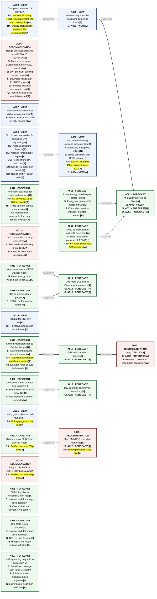

```mermaid
%%{init: {"flowchart": {"htmlLabels": true, "nodeSpacing": 20, "rankSpacing": 60}, "themeCSS": ".arg{width:330px;text-align:left;color:#111111} .core,.c{display:flex;justify-content:space-between;align-items:flex-end;gap:8px;margin-top:4px;padding:3px 6px;color:#111111} .core{border:2px solid} .c{border:1.5px solid;border-radius:10px} .rec{background:#f8c9c9;border-color:#8b1a1a} .val{background:#e3d4f5;border-color:#5b2c8f} .fc{background:#c9ecc9;border-color:#1a6b3a} .view{background:#c9dcf8;border-color:#1a3f8b} .dp{background:#d4d4d4;border-color:#5f5f5f} .obs{background:#e6e6e6;border-color:#888888} mark{background:#e6e6e6;color:#111111;padding:0 2px} .edgeLabel,.edgeLabel *{color:#9a9a9a !important;fill:#9a9a9a !important}"}}%%
flowchart LR
    A001["<div class='arg'><b>A001 · FORECAST</b><div class='core fc'><span>FOMC to skip October, wait until December</span><b>[A]</b></div><div class='c view'><span><b>S:</b> Data takes some pressure off FOMC</span><b>[H]</b></div><div class='c dp'><span><b>RA:</b> <mark>NFP +29k; softer core PCE revisions</mark></span><b>[A]</b></div></div>"]
    A002["<div class='arg'><b>A002 · FORECAST</b><div class='core fc'><span>At least two more Fed hikes</span><b>[A]</b></div><div class='c view'><span><b>S:</b> <b>A008 - VIEW</b></span><b>[A]</b></div><div class='c fc'><span><b>S:</b> <b>A011 - FORECAST</b></span><b>[H]</b></div><div class='c fc'><span><b>Q:</b> <b>A001 - FORECAST</b></span><b>[A]</b></div></div>"]
    A003["<div class='arg'><b>A003 · VIEW</b><div class='core view'><span>OAT-Bund widening exceeds fundamentals</span><b>[A]</b></div><div class='c view'><span><b>S:</b> Latest leg is stop-out selling</span><b>[H]</b></div><div class='c val'><span><b>S:</b> 150bp consistent with BBB+ pricing</span><b>[H]</b></div><div class='c dp'><span><b>RA:</b> <mark>10y OAT-Bund hit 150bp, highest since 2012</mark></span><b>[A]</b></div><div class='c view'><span><b>Q:</b> <b>A004 - VIEW</b></span><b>[A]</b></div></div>"]
    A004["<div class='arg'><b>A004 · VIEW</b><div class='core view'><span>Circuit breakers needed for sustained OAT tightening</span><b>[A]</b></div><div class='c view'><span><b>CO:</b> Needs positioning clear-out</span><b>[A]</b></div><div class='c view'><span><b>CO:</b> Needs French budget to pass</span><b>[A]</b></div><div class='c view'><span><b>CO:</b> Needs strong OAT auctions</span><b>[A]</b></div><div class='c view'><span><b>CO:</b> Needs RN fiscal plan details</span><b>[A]</b></div><div class='c view'><span><b>CO:</b> Needs shift in French polls</span><b>[A]</b></div></div>"]
    A005["<div class='arg'><b>A005 · RECOMMENDATION</b><div class='core rec'><span>Long GBPUSD</span><b>[A]</b></div><div class='c fc'><span><b>S:</b> <b>A018 - FORECAST</b></span><b>[A]</b></div><div class='c view'><span><b>S:</b> Extended GBP shorts into bullish seasonality</span><b>[A]</b></div></div>"]
    A006["<div class='arg'><b>A006 · RECOMMENDATION</b><div class='core rec'><span>Hedge EUR weakness via short EURAUD, EURMXN</span><b>[A]</b></div><div class='c fc'><span><b>S:</b> Forecasts assumed EUR premium before 2027 election</span><b>[A]</b></div><div class='c view'><span><b>S:</b> EUR premium building sooner, faster</span><b>[A]</b></div><div class='c view'><span><b>S:</b> Downside risk to 1.14 EURUSD target</span><b>[A]</b></div><div class='c fc'><span><b>S:</b> Room for EUR risk premium to rise</span><b>[S]</b></div><div class='c view'><span><b>Q:</b> French election risks evenly balanced</span><b>[A]</b></div></div>"]
    A007["<div class='arg'><b>A007 · VIEW</b><div class='core view'><span>K-shaped bifurcation now visible across markets</span><b>[A]</b></div><div class='c view'><span><b>S:</b> Bunds rallied, OATs sold on debt concerns</span><b>[A]</b></div></div>"]
    A008["<div class='arg'><b>A008 · VIEW</b><div class='core view'><span>Hot-economy narrative warranting tightening intact</span><b>[A]</b></div><div class='c view'><span><b>S:</b> <b>A009 - VIEW</b></span><b>[A]</b></div></div>"]
    A009["<div class='arg'><b>A009 · VIEW</b><div class='core view'><span>Data point to robust US activity</span><b>[A]</b></div><div class='c dp'><span><b>RA:</b> <mark>Household survey +406k; unemployment rise from participation</mark></span><b>[A]</b></div><div class='c dp'><span><b>RA:</b> <mark>Steady participation implies 3.9% unemployment</mark></span><b>[A]</b></div></div>"]
    A010["<div class='arg'><b>A010 · FORECAST</b><div class='core fc'><span>Near-term downside for crude and products</span><b>[H]</b></div><div class='c dp'><span><b>RA:</b> <mark>G7 to release up to 100mn barrels</mark></span><b>[A]</b></div><div class='c view'><span><b>RI:</b> Crude strength signals risks remain</span><b>[A]</b></div><div class='c view'><span><b>RI:</b> Workarounds vulnerable; Iran may rebuild leverage</span><b>[A]</b></div></div>"]
    A011["<div class='arg'><b>A011 · FORECAST</b><div class='core fc'><span>Lower energy could require tighter Fed</span><b>[H]</b></div><div class='c view'><span><b>S:</b> Energy not primary US inflation driver</span><b>[A]</b></div><div class='c view'><span><b>S:</b> Entrenched services inflation, elevated demand</span><b>[A]</b></div></div>"]
    A012["<div class='arg'><b>A012 · RECOMMENDATION</b><div class='core rec'><span>Don't turn bullish on long-end USTs</span><b>[A]</b></div><div class='c view'><span><b>S:</b> Fed needs hike delivery for credibility</span><b>[A]</b></div><div class='c fc'><span><b>S:</b> Scope for wider term premiums</span><b>[S]</b></div></div>"]
    A013["<div class='arg'><b>A013 · FORECAST</b><div class='core fc'><span>Near-zero chance of ECB October hike</span><b>[H]</b></div><div class='c view'><span><b>S:</b> Lower energy more welcome relief for ECB</span><b>[A]</b></div></div>"]
    A014["<div class='arg'><b>A014 · FORECAST</b><div class='core fc'><span>One more ECB hike in December, then pause</span><b>[A]</b></div><div class='c fc'><span><b>S:</b> <b>A013 - FORECAST</b></span><b>[H]</b></div><div class='c fc'><span><b>S:</b> <b>A015 - FORECAST</b></span><b>[A]</b></div></div>"]
    A015["<div class='arg'><b>A015 · FORECAST</b><div class='core fc'><span>ECB to hike less than priced</span><b>[A]</b></div><div class='c fc'><span><b>S:</b> ECB to prefer high-for-longer</span><b>[H]</b></div></div>"]
    A016["<div class='arg'><b>A016 · VIEW</b><div class='core view'><span>High bar for ECB TPI use</span><b>[A]</b></div><div class='c view'><span><b>S:</b> TPI intervention carries moral hazard</span><b>[S]</b></div></div>"]
    A017["<div class='arg'><b>A017 · FORECAST</b><div class='core fc'><span>Limited implications for 28 October budget</span><b>[H]</b></div><div class='c view'><span><b>S:</b> Government pursuing phased reforms</span><b>[A]</b></div><div class='c dp'><span><b>RA:</b> <mark>~GBP18bn/yr national social care service</mark></span><b>[A]</b></div><div class='c fc'><span><b>RI:</b> Extra tax hikes or cuts likely needed</span><b>[H]</b></div></div>"]
    A018["<div class='arg'><b>A018 · FORECAST</b><div class='core fc'><span>GBP well placed to benefit</span><b>[A]</b></div><div class='c fc'><span><b>S:</b> <b>A017 - FORECAST</b></span><b>[H]</b></div></div>"]
    A019["<div class='arg'><b>A019 · FORECAST</b><div class='core fc'><span>BoJ quarterly hiking cycle more likely</span><b>[H]</b></div><div class='c fc'><span><b>S:</b> <b>A020 - FORECAST</b></span><b>[H]</b></div></div>"]
    A020["<div class='arg'><b>A020 · FORECAST</b><div class='core fc'><span>Consecutive BoJ October hike unlikely</span><b>[H]</b></div><div class='c view'><span><b>S:</b> Softer expectations may relieve BoJ</span><b>[S]</b></div><div class='c fc'><span><b>S:</b> Ueda speech to be non-committal</span><b>[A]</b></div></div>"]
    A021["<div class='arg'><b>A021 · VIEW</b><div class='core view'><span>3-4pp gap implies second-round tie</span><b>[H]</b></div><div class='c dp'><span><b>RA:</b> <mark>Poll aggregator: Lula +3pp</mark></span><b>[A]</b></div></div>"]
    A022["<div class='arg'><b>A022 · FORECAST</b><div class='core fc'><span>Higher odds of 30 October BanRep hike</span><b>[A]</b></div><div class='c dp'><span><b>RA:</b> <mark>BanRep surprise 25bp hike</mark></span><b>[A]</b></div></div>"]
    A023["<div class='arg'><b>A023 · RECOMMENDATION</b><div class='core rec'><span>Short MXNCOP conviction reinforced</span><b>[A]</b></div><div class='c fc'><span><b>S:</b> <b>A022 - FORECAST</b></span><b>[A]</b></div><div class='c dp'><span><b>RA:</b> <mark>BanRep surprise 25bp hike</mark></span><b>[A]</b></div></div>"]
    A024["<div class='arg'><b>A024 · RECOMMENDATION</b><div class='core rec'><span>Long Coltes UVR vs SOFR; COP basis payer</span><b>[A]</b></div><div class='c dp'><span><b>RA:</b> <mark>BanRep surprise 25bp hike</mark></span><b>[A]</b></div></div>"]
    A025["<div class='arg'><b>A025 · FORECAST</b><div class='core fc'><span>CNB 25bp hike in November, then hold</span><b>[A]</b></div><div class='c view'><span><b>S:</b> No clear path for energy price decline</span><b>[A]</b></div><div class='c fc'><span><b>S:</b> Czech inflation to exceed CNB band</span><b>[A]</b></div></div>"]
    A026["<div class='arg'><b>A026 · FORECAST</b><div class='core fc'><span>One NBH Q4 cut removed</span><b>[A]</b></div><div class='c view'><span><b>S:</b> No clear path for energy price decline</span><b>[A]</b></div><div class='c fc'><span><b>S:</b> NBH on hold for now</span><b>[H]</b></div><div class='c view'><span><b>Q:</b> Hungary has bigger mitigating factors</span><b>[A]</b></div></div>"]
    A027["<div class='arg'><b>A027 · FORECAST</b><div class='core fc'><span>NBP tightening may shift to early 2027</span><b>[S]</b></div><div class='c view'><span><b>S:</b> Subsidies challenge Polish rates forecast</span><b>[A]</b></div><div class='c fc'><span><b>S:</b> Polish short-term inflation outlook improves</span><b>[H]</b></div><div class='c view'><span><b>S:</b> Lower risk of near-term NBP hike</span><b>[A]</b></div></div>"]

    A008 -- Supporting --> A002
    A011 -- Supporting --> A002
    A001 -. Qualifies .-> A002
    A004 -. Qualifies .-> A003
    A018 -- Supporting --> A005
    A009 -- Supporting --> A008
    A013 -- Supporting --> A014
    A015 -- Supporting --> A014
    A017 -- Supporting --> A018
    A020 -- Supporting --> A019
    A022 -- Supporting --> A023

    classDef fc fill:#eef9ee,stroke:#1a6b3a,stroke-width:2px,color:#111111
    classDef rec fill:#fdeeee,stroke:#8b1a1a,stroke-width:2px,color:#111111
    classDef view fill:#eef4fd,stroke:#1a3f8b,stroke-width:2px,color:#111111
    class A001,A002,A010,A011,A013,A014,A015,A017,A018,A019,A020,A022,A025,A026,A027 fc
    class A005,A006,A012,A023,A024 rec
    class A003,A004,A007,A008,A009,A016,A021 view
    linkStyle default stroke:#333333,stroke-width:2px,color:#9a9a9a
```
