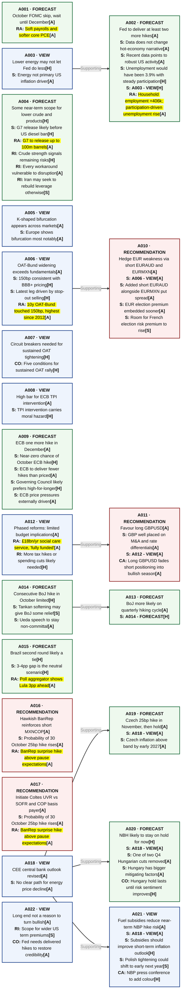

```mermaid
%%{init: {"flowchart": {"htmlLabels": true, "nodeSpacing": 20, "rankSpacing": 60}, "themeCSS": ".arg{width:330px;text-align:left;color:#111111} .core,.c{display:flex;justify-content:space-between;align-items:flex-end;gap:8px;margin-top:4px;padding:3px 6px;color:#111111} .core{border:2px solid} .c{border:1.5px solid;border-radius:10px} .rec{background:#f8c9c9;border-color:#8b1a1a} .val{background:#e3d4f5;border-color:#5b2c8f} .fc{background:#c9ecc9;border-color:#1a6b3a} .view{background:#c9dcf8;border-color:#1a3f8b} .dp{background:#d4d4d4;border-color:#5f5f5f} .obs{background:#e6e6e6;border-color:#888888} mark{background:#e6e6e6;color:#111111;padding:0 2px} .edgeLabel,.edgeLabel *{color:#9a9a9a !important;fill:#9a9a9a !important}"}}%%
flowchart LR
    A001["<div class='arg'><b>A001 · FORECAST</b><div class='core fc'><span>October FOMC skip, wait until December</span><b>[A]</b></div><div class='c dp'><span><b>RA:</b> <mark>Soft payrolls and softer core PCE</mark></span><b>[A]</b></div></div>"]
    A002["<div class='arg'><b>A002 · FORECAST</b><div class='core fc'><span>Fed to deliver at least two more hikes</span><b>[A]</b></div><div class='c view'><span><b>S:</b> Data does not change hot-economy narrative</span><b>[A]</b></div><div class='c view'><span><b>S:</b> Recent data points to robust US activity</span><b>[A]</b></div><div class='c fc'><span><b>S:</b> Unemployment would have been 3.9% with steady participation</span><b>[H]</b></div><div class='c view'><span><b>S:</b> <b>A003 - VIEW</b></span><b>[H]</b></div><div class='c dp'><span><b>RA:</b> <mark>Household employment +406k; participation-driven unemployment rise</mark></span><b>[A]</b></div></div>"]
    A003["<div class='arg'><b>A003 · VIEW</b><div class='core view'><span>Lower energy may not let Fed do less</span><b>[H]</b></div><div class='c view'><span><b>S:</b> Energy not primary US inflation driver</span><b>[A]</b></div></div>"]
    A004["<div class='arg'><b>A004 · FORECAST</b><div class='core fc'><span>Some near-term scope for lower crude and products</span><b>[H]</b></div><div class='c view'><span><b>S:</b> G7 release likely before US diesel ban</span><b>[H]</b></div><div class='c dp'><span><b>RA:</b> <mark>G7 to release up to 100m barrels</mark></span><b>[A]</b></div><div class='c view'><span><b>RI:</b> Crude strength signals remaining risks</span><b>[H]</b></div><div class='c view'><span><b>RI:</b> Every workaround vulnerable to disruption</span><b>[A]</b></div><div class='c view'><span><b>RI:</b> Iran may seek to rebuild leverage otherwise</span><b>[S]</b></div></div>"]
    A005["<div class='arg'><b>A005 · VIEW</b><div class='core view'><span>K-shaped bifurcation appears across markets</span><b>[A]</b></div><div class='c view'><span><b>S:</b> Europe shows bifurcation most notably</span><b>[A]</b></div></div>"]
    A006["<div class='arg'><b>A006 · VIEW</b><div class='core view'><span>OAT-Bund widening exceeds fundamentals</span><b>[A]</b></div><div class='c val'><span><b>S:</b> 150bp consistent with BBB+ pricing</span><b>[H]</b></div><div class='c view'><span><b>S:</b> Latest leg driven by stop-out selling</span><b>[H]</b></div><div class='c dp'><span><b>RA:</b> <mark>10y OAT-Bund touched 150bp, highest since 2012</mark></span><b>[A]</b></div></div>"]
    A007["<div class='arg'><b>A007 · VIEW</b><div class='core view'><span>Circuit breakers needed for sustained OAT tightening</span><b>[H]</b></div><div class='c view'><span><b>CO:</b> Five conditions for sustained OAT rally</span><b>[H]</b></div></div>"]
    A008["<div class='arg'><b>A008 · VIEW</b><div class='core view'><span>High bar for ECB TPI intervention</span><b>[A]</b></div><div class='c view'><span><b>S:</b> TPI intervention carries moral hazard</span><b>[H]</b></div></div>"]
    A009["<div class='arg'><b>A009 · FORECAST</b><div class='core fc'><span>ECB one more hike in December</span><b>[A]</b></div><div class='c fc'><span><b>S:</b> Near-zero chance of October ECB hike</span><b>[H]</b></div><div class='c fc'><span><b>S:</b> ECB to deliver fewer hikes than priced</span><b>[A]</b></div><div class='c view'><span><b>S:</b> Governing Council likely prefers high-for-longer</span><b>[H]</b></div><div class='c view'><span><b>S:</b> ECB price pressures externally driven</span><b>[A]</b></div></div>"]
    A010["<div class='arg'><b>A010 · RECOMMENDATION</b><div class='core rec'><span>Hedge EUR weakness via short EURAUD and EURMXN</span><b>[A]</b></div><div class='c view'><span><b>S:</b> <b>A006 - VIEW</b></span><b>[A]</b></div><div class='c rec'><span><b>S:</b> Added short EURAUD alongside EURMXN put spread</span><b>[A]</b></div><div class='c view'><span><b>S:</b> EUR election premium embedded sooner</span><b>[A]</b></div><div class='c view'><span><b>S:</b> Room for French election risk premium to rise</span><b>[S]</b></div></div>"]
    A011["<div class='arg'><b>A011 · RECOMMENDATION</b><div class='core rec'><span>Favour long GBPUSD</span><b>[A]</b></div><div class='c view'><span><b>S:</b> GBP well placed on M&amp;A and rate differentials</span><b>[A]</b></div><div class='c view'><span><b>S:</b> <b>A012 - VIEW</b></span><b>[A]</b></div><div class='c view'><span><b>CA:</b> Long GBPUSD fades short positioning into bullish season</span><b>[A]</b></div></div>"]
    A012["<div class='arg'><b>A012 · VIEW</b><div class='core view'><span>Phased reforms: limited budget implications</span><b>[A]</b></div><div class='c dp'><span><b>RA:</b> <mark>£18bn/yr social care service, 'fully funded'</mark></span><b>[A]</b></div><div class='c view'><span><b>RI:</b> More tax hikes or spending cuts likely needed</span><b>[H]</b></div></div>"]
    A013["<div class='arg'><b>A013 · FORECAST</b><div class='core fc'><span>BoJ more likely on quarterly hiking cycle</span><b>[A]</b></div><div class='c fc'><span><b>S:</b> <b>A014 - FORECAST</b></span><b>[H]</b></div></div>"]
    A014["<div class='arg'><b>A014 · FORECAST</b><div class='core fc'><span>Consecutive BoJ hike in October limited</span><b>[H]</b></div><div class='c view'><span><b>S:</b> Tankan softening may give BoJ some relief</span><b>[S]</b></div><div class='c fc'><span><b>S:</b> Ueda speech to stay non-committal</span><b>[A]</b></div></div>"]
    A015["<div class='arg'><b>A015 · FORECAST</b><div class='core fc'><span>Brazil second round likely a tie</span><b>[H]</b></div><div class='c view'><span><b>S:</b> 3-4pp gap is the neutral scenario</span><b>[H]</b></div><div class='c dp'><span><b>RA:</b> <mark>Poll aggregator shows Lula 3pp ahead</mark></span><b>[A]</b></div></div>"]
    A016["<div class='arg'><b>A016 · RECOMMENDATION</b><div class='core rec'><span>Hawkish BanRep reinforces short MXNCOP</span><b>[A]</b></div><div class='c fc'><span><b>S:</b> Probability of 30 October 25bp hike rises</span><b>[A]</b></div><div class='c dp'><span><b>RA:</b> <mark>BanRep surprise hike above pause expectations</mark></span><b>[A]</b></div></div>"]
    A017["<div class='arg'><b>A017 · RECOMMENDATION</b><div class='core rec'><span>Initiate Coltes UVR vs SOFR and COP basis payer</span><b>[A]</b></div><div class='c fc'><span><b>S:</b> Probability of 30 October 25bp hike rises</span><b>[A]</b></div><div class='c dp'><span><b>RA:</b> <mark>BanRep surprise hike above pause expectations</mark></span><b>[A]</b></div></div>"]
    A018["<div class='arg'><b>A018 · VIEW</b><div class='core view'><span>CEE central bank outlook revised</span><b>[A]</b></div><div class='c view'><span><b>S:</b> No clear path for energy price decline</span><b>[A]</b></div></div>"]
    A019["<div class='arg'><b>A019 · FORECAST</b><div class='core fc'><span>Czech 25bp hike in November, then hold</span><b>[A]</b></div><div class='c view'><span><b>S:</b> <b>A018 - VIEW</b></span><b>[A]</b></div><div class='c fc'><span><b>S:</b> Czech inflation above band by early 2027</span><b>[A]</b></div></div>"]
    A020["<div class='arg'><b>A020 · FORECAST</b><div class='core fc'><span>NBH likely to stay on hold for now</span><b>[H]</b></div><div class='c view'><span><b>S:</b> <b>A018 - VIEW</b></span><b>[A]</b></div><div class='c fc'><span><b>S:</b> One of two Q4 Hungarian cuts removed</span><b>[A]</b></div><div class='c view'><span><b>S:</b> Hungary has bigger mitigating factors</span><b>[A]</b></div><div class='c view'><span><b>CO:</b> Hungary hold lasts until risk sentiment improves</span><b>[H]</b></div></div>"]
    A021["<div class='arg'><b>A021 · VIEW</b><div class='core view'><span>Fuel subsidies reduce near-term NBP hike risk</span><b>[A]</b></div><div class='c view'><span><b>S:</b> <b>A018 - VIEW</b></span><b>[A]</b></div><div class='c view'><span><b>S:</b> Subsidies should improve short-term inflation outlook</span><b>[H]</b></div><div class='c fc'><span><b>S:</b> Polish tightening could shift to early next year</span><b>[S]</b></div><div class='c view'><span><b>CA:</b> NBP press conference to add colour</span><b>[H]</b></div></div>"]
    A022["<div class='arg'><b>A022 · VIEW</b><div class='core view'><span>Long end not a reason to turn bullish</span><b>[A]</b></div><div class='c fc'><span><b>RI:</b> Scope for wider US term premiums</span><b>[S]</b></div><div class='c view'><span><b>CO:</b> Fed needs delivered hikes to restore credibility</span><b>[A]</b></div></div>"]

    A003 -- Supporting --> A002
    A006 -- Supporting --> A010
    A012 -- Supporting --> A011
    A014 -- Supporting --> A013
    A018 -- Supporting --> A019
    A018 -- Supporting --> A020
    A018 -- Supporting --> A021

    classDef fc fill:#eef9ee,stroke:#1a6b3a,stroke-width:2px,color:#111111
    classDef rec fill:#fdeeee,stroke:#8b1a1a,stroke-width:2px,color:#111111
    classDef view fill:#eef4fd,stroke:#1a3f8b,stroke-width:2px,color:#111111
    class A001,A002,A004,A009,A013,A014,A015,A019,A020 fc
    class A010,A011,A016,A017 rec
    class A003,A005,A006,A007,A008,A012,A018,A021,A022 view
    linkStyle default stroke:#333333,stroke-width:2px,color:#9a9a9a
```
