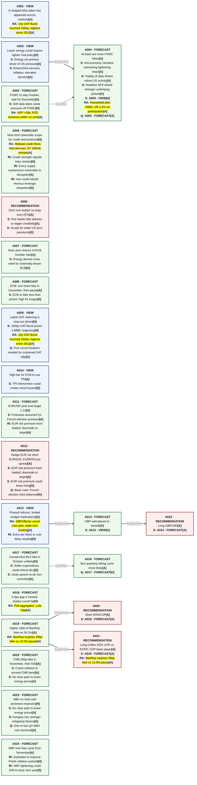

```mermaid
%%{init: {"flowchart": {"htmlLabels": true, "nodeSpacing": 20, "rankSpacing": 60}, "themeCSS": ".arg{width:330px;text-align:left;color:#111111} .core,.c{display:flex;justify-content:space-between;align-items:flex-end;gap:8px;margin-top:4px;padding:3px 6px;color:#111111} .core{border:2px solid} .c{border:1.5px solid;border-radius:10px} .rec{background:#f8c9c9;border-color:#8b1a1a} .val{background:#e3d4f5;border-color:#5b2c8f} .fc{background:#c9ecc9;border-color:#1a6b3a} .view{background:#c9dcf8;border-color:#1a3f8b} .dp{background:#d4d4d4;border-color:#5f5f5f} .obs{background:#e6e6e6;border-color:#888888} mark{background:#e6e6e6;color:#111111;padding:0 2px} .edgeLabel,.edgeLabel *{color:#9a9a9a !important;fill:#9a9a9a !important}"}}%%
flowchart LR
    A001["<div class='arg'><b>A001 · VIEW</b><div class='core view'><span>K-shaped bifurcation has appeared across markets</span><b>[A]</b></div><div class='c dp'><span><b>RA:</b> <mark>10y OAT-Bund touched 150bp, highest since 2012</mark></span><b>[A]</b></div></div>"]
    A002["<div class='arg'><b>A002 · FORECAST</b><div class='core fc'><span>FOMC to skip October, wait for December</span><b>[A]</b></div><div class='c view'><span><b>S:</b> Soft data takes some pressure off FOMC</span><b>[H]</b></div><div class='c dp'><span><b>RA:</b> <mark>NFP +29k; PCE revisions softer on core</mark></span><b>[A]</b></div></div>"]
    A003["<div class='arg'><b>A003 · VIEW</b><div class='core view'><span>Lower energy could require tighter Fed policy</span><b>[H]</b></div><div class='c view'><span><b>S:</b> Energy not primary driver of US pressure</span><b>[A]</b></div><div class='c view'><span><b>S:</b> Entrenched services inflation, elevated demand</span><b>[A]</b></div></div>"]
    A004["<div class='arg'><b>A004 · FORECAST</b><div class='core fc'><span>At least two more FOMC hikes</span><b>[A]</b></div><div class='c view'><span><b>S:</b> Hot-economy narrative warranting tightening intact</span><b>[A]</b></div><div class='c view'><span><b>S:</b> Totality of data shows robust US activity</span><b>[A]</b></div><div class='c view'><span><b>S:</b> Headline NFP belied stronger underlying picture</span><b>[A]</b></div><div class='c view'><span><b>S:</b> <b>A003 - VIEW</b></span><b>[H]</b></div><div class='c dp'><span><b>RA:</b> <mark>Household jobs +406k; UR 4.2% on participation</mark></span><b>[A]</b></div><div class='c fc'><span><b>Q:</b> <b>A002 - FORECAST</b></span><b>[A]</b></div></div>"]
    A005["<div class='arg'><b>A005 · FORECAST</b><div class='core fc'><span>Near-term downside scope for crude and products</span><b>[H]</b></div><div class='c dp'><span><b>RA:</b> <mark>Mideast crude flows near pre-war; G7 100mb release</mark></span><b>[A]</b></div><div class='c view'><span><b>RI:</b> Crude strength signals risks remain</span><b>[H]</b></div><div class='c view'><span><b>RI:</b> Every supply workaround vulnerable to disruption</span><b>[A]</b></div><div class='c view'><span><b>RI:</b> Iran could rebuild Hormuz leverage elsewhere</span><b>[S]</b></div></div>"]
    A006["<div class='arg'><b>A006 · RECOMMENDATION</b><div class='core rec'><span>Don't turn bullish on long-end USTs</span><b>[A]</b></div><div class='c view'><span><b>S:</b> Fed needs hike delivery to regain credibility</span><b>[A]</b></div><div class='c fc'><span><b>S:</b> Scope for wider US term premiums</span><b>[S]</b></div></div>"]
    A007["<div class='arg'><b>A007 · FORECAST</b><div class='core fc'><span>Near-zero chance of ECB October hike</span><b>[A]</b></div><div class='c view'><span><b>S:</b> Energy decline more relief for externally-driven ECB</span><b>[A]</b></div></div>"]
    A008["<div class='arg'><b>A008 · FORECAST</b><div class='core fc'><span>ECB: one more hike in December, then pause</span><b>[A]</b></div><div class='c fc'><span><b>S:</b> ECB to hike less than priced; high for longer</span><b>[A]</b></div></div>"]
    A009["<div class='arg'><b>A009 · VIEW</b><div class='core view'><span>Latest OAT widening is stop-out driven</span><b>[H]</b></div><div class='c val'><span><b>S:</b> 150bp OAT-Bund prices a BBB+ trajectory</span><b>[H]</b></div><div class='c dp'><span><b>RA:</b> <mark>10y OAT-Bund touched 150bp, highest since 2012</mark></span><b>[A]</b></div><div class='c view'><span><b>Q:</b> Five circuit breakers needed for sustained OAT rally</span><b>[A]</b></div></div>"]
    A010["<div class='arg'><b>A010 · VIEW</b><div class='core view'><span>High bar for ECB to use TPI</span><b>[A]</b></div><div class='c view'><span><b>S:</b> TPI intervention could create moral hazard</span><b>[S]</b></div></div>"]
    A011["<div class='arg'><b>A011 · FORECAST</b><div class='core fc'><span>EURUSD year-end target 1.14</span><b>[A]</b></div><div class='c fc'><span><b>S:</b> Forecasts assumed Q1 French-election premium</span><b>[A]</b></div><div class='c view'><span><b>RI:</b> EUR risk premium front-loaded; downside to target</span><b>[A]</b></div></div>"]
    A012["<div class='arg'><b>A012 · RECOMMENDATION</b><div class='core rec'><span>Hedge EUR via short EURAUD, EURMXN put spread</span><b>[A]</b></div><div class='c view'><span><b>S:</b> EUR risk premium front-loaded; downside to target</span><b>[A]</b></div><div class='c fc'><span><b>S:</b> EUR risk premium could keep rising</span><b>[S]</b></div><div class='c view'><span><b>Q:</b> Base case: French election risks balanced</span><b>[A]</b></div></div>"]
    A013["<div class='arg'><b>A013 · VIEW</b><div class='core view'><span>Phased reforms; limited budget implications</span><b>[A]</b></div><div class='c dp'><span><b>RA:</b> <mark>GBP18bn/yr social care plan, triple-lock funding</mark></span><b>[A]</b></div><div class='c fc'><span><b>RI:</b> Extra tax hikes or cuts likely needed</span><b>[H]</b></div></div>"]
    A014["<div class='arg'><b>A014 · FORECAST</b><div class='core fc'><span>GBP well placed to benefit</span><b>[A]</b></div><div class='c view'><span><b>S:</b> <b>A013 - VIEW</b></span><b>[A]</b></div></div>"]
    A015["<div class='arg'><b>A015 · RECOMMENDATION</b><div class='core rec'><span>Long GBPUSD</span><b>[A]</b></div><div class='c fc'><span><b>S:</b> <b>A014 - FORECAST</b></span><b>[A]</b></div></div>"]
    A016["<div class='arg'><b>A016 · FORECAST</b><div class='core fc'><span>BoJ quarterly hiking cycle more likely</span><b>[A]</b></div><div class='c fc'><span><b>Q:</b> <b>A017 - FORECAST</b></span><b>[H]</b></div></div>"]
    A017["<div class='arg'><b>A017 · FORECAST</b><div class='core fc'><span>Consecutive BoJ hike in October unlikely</span><b>[H]</b></div><div class='c view'><span><b>S:</b> Softer expectations could relieve BoJ</span><b>[S]</b></div><div class='c fc'><span><b>S:</b> Ueda speech to be non-committal</span><b>[A]</b></div></div>"]
    A018["<div class='arg'><b>A018 · FORECAST</b><div class='core fc'><span>3-4pp gap is neutral, implies runoff tie</span><b>[H]</b></div><div class='c dp'><span><b>RA:</b> <mark>Poll aggregator: Lula +3pp</mark></span><b>[A]</b></div></div>"]
    A019["<div class='arg'><b>A019 · FORECAST</b><div class='core fc'><span>Higher odds of BanRep hike on 30 Oct</span><b>[A]</b></div><div class='c dp'><span><b>RA:</b> <mark>BanRep surprise 25bp hike vs 12.0% pause</mark></span><b>[A]</b></div></div>"]
    A020["<div class='arg'><b>A020 · RECOMMENDATION</b><div class='core rec'><span>Short MXNCOP</span><b>[A]</b></div><div class='c fc'><span><b>S:</b> <b>A019 - FORECAST</b></span><b>[A]</b></div></div>"]
    A021["<div class='arg'><b>A021 · RECOMMENDATION</b><div class='core rec'><span>Long Coltes 2031 UVR vs SOFR; COP basis payer</span><b>[A]</b></div><div class='c fc'><span><b>S:</b> <b>A019 - FORECAST</b></span><b>[A]</b></div><div class='c dp'><span><b>RA:</b> <mark>BanRep surprise 25bp hike vs 12.0% pause</mark></span><b>[A]</b></div></div>"]
    A022["<div class='arg'><b>A022 · FORECAST</b><div class='core fc'><span>CNB 25bp hike in November, then hold</span><b>[A]</b></div><div class='c fc'><span><b>S:</b> Czech inflation to exceed CNB band</span><b>[A]</b></div><div class='c view'><span><b>S:</b> No clear path to lower energy prices</span><b>[A]</b></div></div>"]
    A023["<div class='arg'><b>A023 · FORECAST</b><div class='core fc'><span>NBH on hold until sentiment improves</span><b>[H]</b></div><div class='c view'><span><b>S:</b> No clear path to lower energy prices</span><b>[A]</b></div><div class='c view'><span><b>S:</b> Hungary has stronger mitigating factors</span><b>[A]</b></div><div class='c fc'><span><b>Q:</b> One of two Q4 NBH cuts removed</span><b>[A]</b></div></div>"]
    A024["<div class='arg'><b>A024 · FORECAST</b><div class='core fc'><span>NBP mini hike cycle from November</span><b>[A]</b></div><div class='c fc'><span><b>RI:</b> Subsidies to improve Polish inflation outlook</span><b>[H]</b></div><div class='c fc'><span><b>RI:</b> NBP tightening could shift to early next year</span><b>[S]</b></div></div>"]

    A003 -- Supporting --> A004
    A002 -. Qualifies .-> A004
    A013 -- Supporting --> A014
    A014 -- Supporting --> A015
    A017 -. Qualifies .-> A016
    A019 -- Supporting --> A020
    A019 -- Supporting --> A021

    classDef fc fill:#eef9ee,stroke:#1a6b3a,stroke-width:2px,color:#111111
    classDef rec fill:#fdeeee,stroke:#8b1a1a,stroke-width:2px,color:#111111
    classDef view fill:#eef4fd,stroke:#1a3f8b,stroke-width:2px,color:#111111
    class A002,A004,A005,A007,A008,A011,A014,A016,A017,A018,A019,A022,A023,A024 fc
    class A006,A012,A015,A020,A021 rec
    class A001,A003,A009,A010,A013 view
    linkStyle default stroke:#333333,stroke-width:2px,color:#9a9a9a
```
